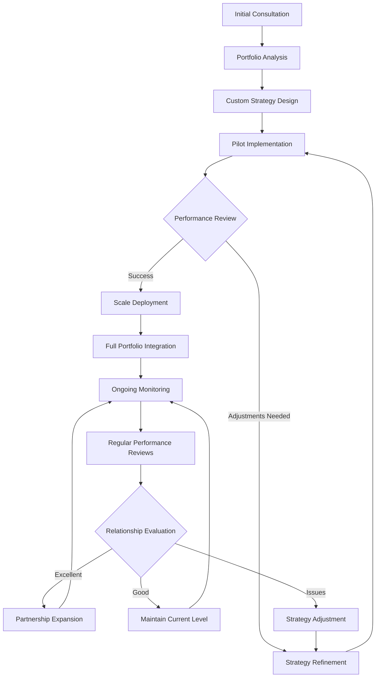

# QBTC Commercial Applications
*Institutional portfolio optimization solutions*

## 🎯 **Market Focus**

QBTC serves institutional clients who need **reliable portfolio optimization** for cryptocurrency allocations. Our approach is conservative, mathematical, and aligned with institutional risk management standards.

## 🏛️ **Target Clients**

### **Multi-Family Offices**
*Managing crypto allocations for high-net-worth families*

**What they need:**
- Professional portfolio management for crypto holdings
- Automated rebalancing when allocations drift
- Risk monitoring and compliance reporting
- Integration with existing wealth management systems

**What we provide:**
- Mathematical portfolio optimization
- Systematic rebalancing based on proven algorithms
- Comprehensive reporting and audit trails
- Professional-grade infrastructure and support

### **Registered Investment Advisors**
*Independent advisors managing client crypto allocations*

**What they need:**
- Efficient management of multiple crypto portfolios
- Conservative risk management aligned with fiduciary duty  
- Clear reporting for client communications
- Tools that reduce manual portfolio management work

**What we provide:**
- Multi-client portfolio management capabilities
- Conservative default settings and risk controls
- Automated reporting and client communication tools
- Integration with existing advisor platforms

### **Asset Management Firms**
*Traditional managers adding crypto to institutional portfolios*

**What they need:**
- Strategic crypto allocation within diversified portfolios
- Risk management that integrates with existing frameworks
- Institutional-grade systems and operational controls
- Full regulatory compliance and documentation

**What we provide:**
- Institutional-quality crypto portfolio optimization
- Risk management tools and reporting
- Enterprise-grade security and monitoring
- Comprehensive compliance documentation

## 💼 **Service Approach**

### 🔄 **Partnership Implementation Flow**


### 📊 **Value Creation Framework**
```
    ┌───────────────── CLIENT VALUE CREATION ─────────────────┐
    │                                                                 │
    │  🏆 PERFORMANCE METRICS        📊 OPERATIONAL BENEFITS  │
    │  ┌─────────────────────────   │  ┌──────────────────────┐  │
    │  │ • Risk-Adjusted Returns     │   │  │ • Automated Rebalancing  │  │
    │  │ • Sharpe Ratio Improvement  │   │  │ • Real-time Monitoring   │  │
    │  │ • Drawdown Reduction       │   │  │ • Compliance Reporting   │  │
    │  │ • Volatility Management     │   │  │ • Tax Optimization       │  │
    │  └─────────────────────────   │  └──────────────────────┘  │
    │                                                                 │
    │  🔒 RISK MANAGEMENT           📈 REPORTING & ANALYTICS │
    │  ┌─────────────────────────   │  ┌──────────────────────┐  │
    │  │ • VaR Monitoring           │   │  │ • Performance Attribution│  │
    │  │ • Correlation Analysis     │   │  │ • Risk Analytics        │  │
    │  │ • Position Sizing          │   │  │ • Client Dashboards     │  │
    │  │ • Circuit Breakers         │   │  │ • Regulatory Reports    │  │
    │  └─────────────────────────   │  └──────────────────────┘  │
    │                                                                 │
    └─────────────────────────────────────────────────────────────────┘
```

### **Performance-Based Partnership**
Rather than fixed fees, we align our compensation with client success:

- **Setup costs** for implementation and integration (customized per client)
- **Performance-based fees** tied to measurable portfolio improvements
- **Success sharing** - we only do well when you do well
- **Transparent measurement** of value creation

### **Conservative Implementation**
- Start with smaller allocations to demonstrate value
- Gradual expansion based on proven results  
- Regular performance reviews and optimization
- Long-term partnership approach

### **Professional Standards**
- Independent performance verification
- Clear reporting and fee calculations
- Institutional-grade security and compliance
- Professional support and account management

## 🏗️ **Technical Capabilities**

### **Portfolio Optimization**
- Mathematical optimization using modern portfolio theory
- Automated rebalancing based on configurable thresholds
- Tax-efficient rebalancing strategies
- Risk monitoring and alert systems

### **Integration & Infrastructure**
- API integration with major custody platforms
- Compatibility with existing portfolio management systems
- Real-time monitoring and reporting dashboards
- Enterprise-grade security and operational controls

### **Risk Management**
- Conservative position sizing and risk controls
- Real-time portfolio risk monitoring
- Automated circuit breakers and safety mechanisms
- Comprehensive audit trails and compliance reporting

## 📊 **Value Proposition**

### **Measurable Improvements**
- Enhanced risk-adjusted returns through optimization
- Reduced portfolio volatility and drawdown
- Improved tax efficiency through intelligent rebalancing
- Operational efficiency and reduced management overhead

### **Institutional Quality**
- Professional-grade infrastructure and monitoring
- Full compliance documentation and audit trails
- Integration with existing institutional systems
- Dedicated support and account management

### **Conservative Approach**
- Risk-first design with strict position limits
- Conservative default settings appropriate for institutions
- Emphasis on wealth preservation over aggressive returns
- Long-term partnership and relationship focus

## 🤝 **Partnership Model**

### **Implementation Process**
1. **Initial consultation** and portfolio analysis
2. **Pilot implementation** with performance monitoring
3. **Gradual scaling** based on demonstrated results
4. **Long-term partnership** with regular optimization

### **Compensation Structure**
- Implementation costs for setup and integration
- Performance-based fees tied to measurable value creation
- Transparent calculation and independent verification
- Success sharing aligned with client objectives

### **Professional Support**
- Dedicated relationship management
- Regular performance reviews and optimization
- Professional training and documentation
- Long-term strategic partnership development

## 📞 **Next Steps**

For institutions interested in exploring professional crypto portfolio optimization:

**Initial Discussion**
- Portfolio analysis and improvement opportunities
- Discussion of implementation approach and timeline
- Review of compensation structure and terms
- Planning for pilot implementation

**Professional Engagement**
- Detailed technical and operational due diligence
- Comprehensive implementation planning
- Performance measurement and success criteria
- Long-term partnership development

---

*QBTC: Professional portfolio optimization for institutional cryptocurrency allocations.*

<citations>
<document>
<document_type>RULE</document_type>
<document_id>B0INMecNdCVRTf71t8SN0G</document_id>
</document>
</citations>
