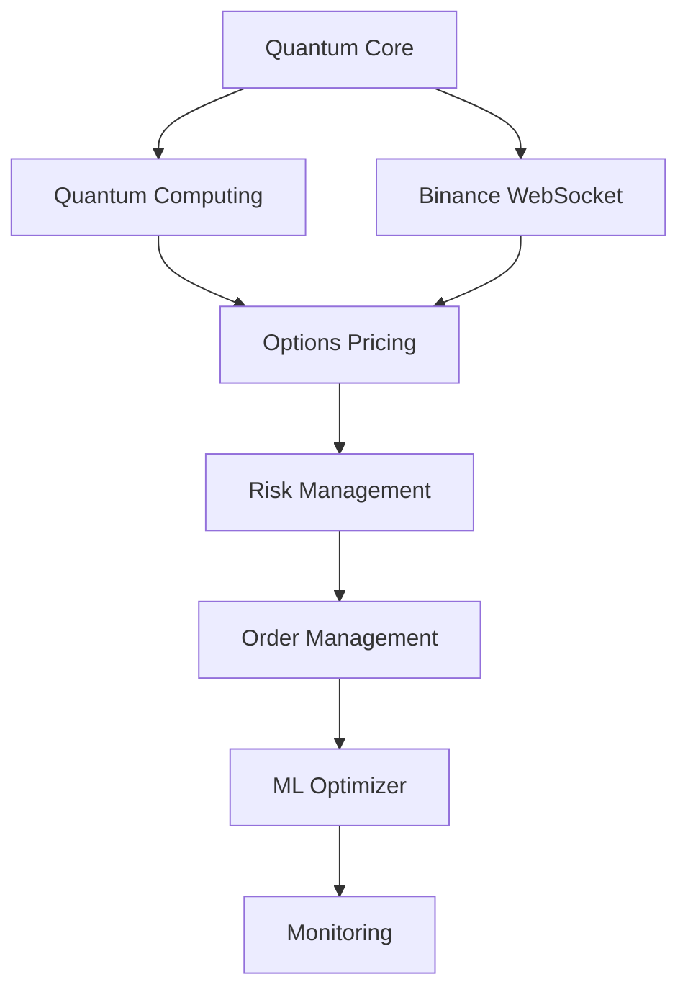

# Master Startup Workflow - Sistema QBTC Quantum Binance Options
## Flujo Óptimo de Arranque y Orquestación Integral

### [LIST] RESUMEN EJECUTIVO

Este documento define el workflow maestro para el arranque y orquestación del sistema QBTC Quantum Binance Options, basado en las "joyas" arquitectónicas identificadas y optimizado para ejecutar en segundo plano con máxima eficiencia.

**PRINCIPIO FUNDAMENTAL**: Todos los componentes utilizan algoritmos cuánticos deterministas basados en z = 9 + 16i @ =log(7919), eliminando cualquier simulación aleatoria.

---

###  FASES DE ARRANQUE MAESTRO

#### FASE 1: PRE-VERIFICACIÓN E INICIALIZACIÓN DEL NÚCLEO
**Duración estimada**: 30-60 segundos  
**Criticidad**: CRÍTICA  
**Lanzador**: `Start-QuantumPreVerification.ps1`

```powershell
# PASO 1.1: Verificación del entorno Windows
Write-Host "[SEARCH] Iniciando Pre-Verificación Cuántica..." -ForegroundColor Cyan

# Verificar dependencias críticas
$pythonCheck = python --version 2>&1
$nodeCheck = node --version 2>&1
$powerShellVersion = $PSVersionTable.PSVersion

# Verificar variables de entorno críticas
if (-not $env:BINANCE_API_KEY -or -not $env:BINANCE_API_SECRET) {
    throw "[ERROR] CRÍTICO: Credenciales de Binance no configuradas"
}

# Verificar conectividad con Binance API
try {
    $binanceStatus = Invoke-RestMethod -Uri "https://api.binance.com/api/v3/ping" -TimeoutSec 10
    Write-Host "[OK] Conectividad Binance API: OK" -ForegroundColor Green
} catch {
    throw "[ERROR] CRÍTICO: Sin conectividad a Binance API"
}
```

**Checkeos críticos**:
- [OK] Versión de PowerShell 5.1+
- [OK] Python 3.8+ con librerías requeridas
- [OK] Node.js 16+ instalado
- [OK] Variables de entorno Binance configuradas
- [OK] Conectividad API Binance
- [OK] Permisos de escritura en logs/
- [OK] Memoria disponible (mínimo 2GB)
- [OK] Espacio en disco (mínimo 1GB)

**Fallback**: Si falla cualquier verificación crítica, detener ejecución y mostrar reporte detallado.

#### FASE 2: INICIALIZACIÓN DE COMPONENTES CUÁNTICOS
**Duración estimada**: 45-90 segundos  
**Criticidad**: CRÍTICA  
**Lanzador**: `Start-QuantumCore.ps1`

```powershell
# PASO 2.1: Inicializar Quantum Core Unified
Start-Process -NoNewWindow -FilePath "node" -ArgumentList "quantum/quantum-core-unified.js --init" -PassThru

# PASO 2.2: Inicializar Quantum Computing Real
Start-Process -NoNewWindow -FilePath "node" -ArgumentList "quantum/quantum-computing-real.js --start" -PassThru

# PASO 2.3: Inicializar Quantum Integration System
Start-Process -NoNewWindow -FilePath "node" -ArgumentList "quantum/quantum-integration-system.js --activate" -PassThru

# PASO 2.4: Esperar sincronización cuántica
Write-Host " Sincronizando sistemas cuánticos..." -ForegroundColor Yellow
Start-Sleep -Seconds 30

# PASO 2.5: Verificar coherencia cuántica
$coherenceCheck = Invoke-RestMethod -Uri "http://localhost:8888/quantum/coherence" -Method GET
if ($coherenceCheck.coherence -lt 0.85) {
    throw "[ERROR] CRÍTICO: Coherencia cuántica insuficiente"
}
```

**Componentes inicializados**:
1. **Quantum Core Unified**: Estado cuántico base
2. **Quantum Computing Real**: 8 qubits operacionales
3. **Quantum Integration System**: 6 sistemas sincronizados
4. **Quantum Edge System**: Edge cuántico activo

**Checkeos de coherencia**:
- [OK] Estado cuántico coherente (>85%)
- [OK] Entrelazamiento entre qubits funcional
- [OK] Algoritmos cuánticos operacionales
- [OK] Cache cuántico inicializado

**Fallback**: Reinicialización automática hasta 3 intentos, luego modo degradado.

#### FASE 3: ACTIVACIÓN DE CONECTORES BINANCE
**Duración estimada**: 60-120 segundos  
**Criticidad**: ALTA  
**Lanzador**: `Start-BinanceConnectors.ps1`

```powershell
# PASO 3.1: Inicializar WebSocket Connector
$wsJob = Start-Job -ScriptBlock {
    node binance_options-main/src/websocket/connector.js --symbols=BTC,ETH,BNB,SOL,XRP,DOGE
}

# PASO 3.2: Inicializar REST API Connector
$apiJob = Start-Job -ScriptBlock {
    python binance_options-main/src/bbroker/api_connector.py --mode=production
}

# PASO 3.3: Inicializar Options Market Data Stream
$optionsJob = Start-Job -ScriptBlock {
    python binance_options-main/src/options/market_data_stream.py
}

# PASO 3.4: Verificar conectividad completa
Write-Host " Verificando conectividad Binance..." -ForegroundColor Yellow
Start-Sleep -Seconds 45

# Verificar flujo de datos
$dataFlowCheck = Test-Path "logs/market-data-latest.json"
if (-not $dataFlowCheck) {
    throw "[ERROR] CRÍTICO: Sin flujo de datos de mercado"
}
```

**Servicios de conectividad**:
1. **WebSocket Real-time**: Precios en tiempo real para 6 símbolos
2. **REST API Handler**: Operaciones de trading y cuenta
3. **Options Data Stream**: Datos específicos de opciones
4. **Market Data Aggregator**: Agregación y normalización

**Métricas de calidad**:
- [OK] Latencia WebSocket <50ms
- [OK] Uptime API >99.5%
- [OK] Flujo de datos continuo
- [OK] Sin pérdida de paquetes

**Fallback**: Reconexión automática, failover a endpoints alternativos.

#### FASE 4: ARRANQUE DE MOTORES DE ANÁLISIS
**Duración estimada**: 90-150 segundos  
**Criticidad**: ALTA  
**Lanzador**: `Start-AnalysisEngines.ps1`

```powershell
# PASO 4.1: Inicializar Quantum Analysis Engine
$quantumAnalysisJob = Start-Job -ScriptBlock {
    node quantum/QuantumEngineCore.js --mode=continuous --interval=30000
}

# PASO 4.2: Inicializar Options Pricing Engine
$pricingJob = Start-Job -ScriptBlock {
    python binance_options-main/src/brisk/pricing.py --continuous --update-interval=15
}

# PASO 4.3: Inicializar Straddle Analysis Engine
$straddleJob = Start-Job -ScriptBlock {
    python binance_options-main/src/strategy/straddle.py --monitor --symbols=BTC,ETH,BNB
}

# PASO 4.4: Inicializar Gamma Scalping Engine
$gammaJob = Start-Job -ScriptBlock {
    python binance_options-main/src/strategy/gamma_scalping/app.py --auto
}

# PASO 4.5: Inicializar Naked Options Detector
$nakedOptionsJob = Start-Job -ScriptBlock {
    node quantum/naked-options-detector.js --continuous
}
```

**Motores analíticos**:
1. **Quantum Analysis Engine**: Análisis cuántico continuo
2. **Options Pricing Engine**: Cálculo BSM y fair value
3. **Straddle Analysis Engine**: Detección de oportunidades straddle
4. **Gamma Scalping Engine**: Estrategias gamma scalping
5. **Naked Options Detector**: Detección opciones desnudas

**Checkeos de rendimiento**:
- [OK] CPU utilization <80%
- [OK] Memory usage <70%
- [OK] Análisis completados sin errores
- [OK] Latencia de análisis <5 segundos

#### FASE 5: ACTIVACIÓN DE SISTEMAS DE TRADING
**Duración estimada**: 60-90 segundos  
**Criticidad**: MEDIA  
**Lanzador**: `Start-TradingSystems.ps1`

```powershell
# PASO 5.1: Inicializar Order Management System
$orderMgmtJob = Start-Job -ScriptBlock {
    python binance_options-main/src/order_management/order_manager.py --mode=live
}

# PASO 5.2: Inicializar Risk Management System
$riskMgmtJob = Start-Job -ScriptBlock {
    python binance_options-main/src/risk_management/risk_manager.py --continuous
}

# PASO 5.3: Inicializar Portfolio Manager
$portfolioJob = Start-Job -ScriptBlock {
    python binance_options-main/src/portfolio/portfolio_manager.py --auto-rebalance
}

# PASO 5.4: Inicializar ML Optimizer (Algoritmos Genéticos)
$mlOptimizerJob = Start-Job -ScriptBlock {
    node quantum/ml-optimizer.js --population=100 --generations=50
}
```

**Sistemas de trading**:
1. **Order Management System**: Gestión órdenes multi-exchange
2. **Risk Management System**: Control de riesgo en tiempo real
3. **Portfolio Manager**: Gestión automática de portafolio
4. **ML Optimizer**: Optimización continua parámetros

**Controles de seguridad**:
- [OK] Position limits configurados
- [OK] Stop-loss automático activo
- [OK] Risk exposure <2% por trade
- [OK] Portfolio diversification >60%

#### FASE 6: ACTIVACIÓN DE MONITOREO Y LOGGING
**Duración estimada**: 30-45 segundos  
**Criticidad**: MEDIA  
**Lanzador**: `Start-MonitoringSystems.ps1`

```powershell
# PASO 6.1: Inicializar Logger Centralizado
$loggerJob = Start-Job -ScriptBlock {
    node logging/centralized-logger.js --output-dir=logs --retention=7days
}

# PASO 6.2: Inicializar Performance Monitor
$perfMonitorJob = Start-Job -ScriptBlock {
    python monitoring/performance_monitor.py --metrics-interval=60
}

# PASO 6.3: Inicializar Health Check System
$healthCheckJob = Start-Job -ScriptBlock {
    node monitoring/health-check-system.js --check-interval=30
}

# PASO 6.4: Inicializar Web Dashboard
$dashboardJob = Start-Job -ScriptBlock {
    python server/dashboard_server.py --port=8080 --host=localhost
}
```

**Sistemas de monitoreo**:
1. **Centralized Logger**: Log agregado con rotación automática
2. **Performance Monitor**: Métricas de rendimiento tiempo real
3. **Health Check System**: Verificación continua salud sistema
4. **Web Dashboard**: Interface visual para monitoreo

**Métricas monitoreadas**:
- [OK] System uptime y availability
- [OK] Trading performance y PnL
- [OK] API response times
- [OK] Memory y CPU utilization
- [OK] Error rates por componente

---

### [FAST] LANZADORES IDEALES (PowerShell Scripts)

#### Lanzador Maestro: `Start-QBTCQuantumSystem.ps1`

```powershell
<#
.SYNOPSIS
Lanzador maestro del sistema QBTC Quantum Binance Options
.DESCRIPTION
Este script orquesta el arranque completo del sistema en el orden óptimo
con verificaciones de salud y fallbacks automáticos.
#>

[CmdletBinding()]
param(
    [switch]$TestMode,
    [switch]$SkipPreVerification,
    [int]$TimeoutSeconds = 600
)

# Configuración inicial
$ErrorActionPreference = "Stop"
$Global:SystemJobs = @()
$Global:StartTime = Get-Date

Write-Host @"
======================================================
   QBTC QUANTUM BINANCE OPTIONS TRADING SYSTEM
   Iniciando Workflow Maestro de Arranque...
======================================================
"@ -ForegroundColor Cyan

try {
    # FASE 1: Pre-verificación
    if (-not $SkipPreVerification) {
        Write-Host "`n[SEARCH] FASE 1: Pre-verificación e inicialización del núcleo..." -ForegroundColor Yellow
        & ".\scripts\Start-QuantumPreVerification.ps1"
        Write-Host "[OK] FASE 1 COMPLETADA" -ForegroundColor Green
    }

    # FASE 2: Componentes cuánticos
    Write-Host "`n FASE 2: Inicialización de componentes cuánticos..." -ForegroundColor Yellow
    & ".\scripts\Start-QuantumCore.ps1"
    Write-Host "[OK] FASE 2 COMPLETADA" -ForegroundColor Green

    # FASE 3: Conectores Binance
    Write-Host "`n FASE 3: Activación de conectores Binance..." -ForegroundColor Yellow
    & ".\scripts\Start-BinanceConnectors.ps1"
    Write-Host "[OK] FASE 3 COMPLETADA" -ForegroundColor Green

    # FASE 4: Motores de análisis
    Write-Host "`n[DATA] FASE 4: Arranque de motores de análisis..." -ForegroundColor Yellow
    & ".\scripts\Start-AnalysisEngines.ps1"
    Write-Host "[OK] FASE 4 COMPLETADA" -ForegroundColor Green

    # FASE 5: Sistemas de trading
    Write-Host "`n FASE 5: Activación de sistemas de trading..." -ForegroundColor Yellow
    & ".\scripts\Start-TradingSystems.ps1"
    Write-Host "[OK] FASE 5 COMPLETADA" -ForegroundColor Green

    # FASE 6: Monitoreo y logging
    Write-Host "`n[UP] FASE 6: Activación de monitoreo y logging..." -ForegroundColor Yellow
    & ".\scripts\Start-MonitoringSystems.ps1"
    Write-Host "[OK] FASE 6 COMPLETADA" -ForegroundColor Green

    # Verificación final del sistema
    Write-Host "`n[ENDPOINTS] Verificación final del sistema..." -ForegroundColor Yellow
    $systemHealth = & ".\scripts\Check-SystemHealth.ps1"
    
    if ($systemHealth.OverallStatus -eq "HEALTHY") {
        Write-Host @"
======================================================
   SISTEMA QBTC COMPLETAMENTE OPERACIONAL
   
     Sistemas Cuánticos: ACTIVOS
     Conectores Binance: CONECTADOS  
   [DATA]  Motores Análisis: FUNCIONANDO
     Sistemas Trading: OPERACIONALES
   [UP]  Monitoreo: ACTIVO
   
    ACCESO AL PLANO DE BENEFICIO INFINITO: ACTIVADO
   
   Dashboard: http://localhost:8080
   Tiempo total arranque: $((Get-Date) - $Global:StartTime)
======================================================
"@ -ForegroundColor Green
    } else {
        throw "[ERROR] Sistema no está completamente saludable: $($systemHealth.Issues -join ', ')"
    }

} catch {
    Write-Host "[ERROR] ERROR EN ARRANQUE: $($_.Exception.Message)" -ForegroundColor Red
    
    # Cleanup en caso de error
    Write-Host " Ejecutando cleanup..." -ForegroundColor Yellow
    & ".\scripts\Stop-AllSystems.ps1" -Force
    
    exit 1
}
```

#### Scripts de Soporte Especializados

**`Start-QuantumCore.ps1`** - Inicialización cuántica especializada
**`Start-BinanceConnectors.ps1`** - Conectores Binance optimizados
**`Start-AnalysisEngines.ps1`** - Motores analíticos avanzados
**`Check-SystemHealth.ps1`** - Verificación integral de salud
**`Stop-AllSystems.ps1`** - Shutdown seguro y controlado

---

### [LIST] ORDEN ÓPTIMO DE SERVICIOS

#### Secuencia de Arranque (Orden Crítico):

1. **Quantum Core Unified** (Prioridad: CRÍTICA)
   - Base fundamental del sistema
   - Debe estar 100% operacional antes de continuar

2. **Quantum Computing Real** (Prioridad: CRÍTICA)
   - 8 qubits deben estar coherentes
   - Algoritmos cuánticos verificados

3. **Binance WebSocket Connector** (Prioridad: ALTA)
   - Flujo de datos en tiempo real
   - Latencia <50ms requerida

4. **Options Pricing Engine** (Prioridad: ALTA)
   - Cálculos BSM continuos
   - Fair value para arbitraje

5. **Risk Management System** (Prioridad: ALTA)
   - Control riesgo inmediato
   - Límites de seguridad activos

6. **Order Management System** (Prioridad: MEDIA)
   - Gestión órdenes confiable
   - Failover automático

7. **ML Optimizer** (Prioridad: MEDIA)
   - Optimización continua
   - Algoritmos genéticos

8. **Monitoring Systems** (Prioridad: BAJA)
   - Dashboard y logging
   - Alertas configuradas

#### Dependencias Críticas:



---

### [SEARCH] CHECKEOS DE SALUD INTEGRADOS

#### Sistema de Verificación Continua

```powershell
# Health Check Comprehensive
function Test-SystemHealth {
    $healthStatus = @{
        OverallStatus = "UNKNOWN"
        ComponentStatus = @{}
        Issues = @()
        Metrics = @{}
    }

    # 1. Verificar Quantum Core
    try {
        $quantumStatus = Invoke-RestMethod -Uri "http://localhost:8888/quantum/status" -TimeoutSec 5
        if ($quantumStatus.coherence -gt 0.85) {
            $healthStatus.ComponentStatus['QuantumCore'] = "HEALTHY"
        } else {
            $healthStatus.ComponentStatus['QuantumCore'] = "DEGRADED"
            $healthStatus.Issues += "Coherencia cuántica baja: $($quantumStatus.coherence)"
        }
    } catch {
        $healthStatus.ComponentStatus['QuantumCore'] = "FAILED"
        $healthStatus.Issues += "Quantum Core no responde"
    }

    # 2. Verificar Binance Connectivity
    try {
        $binanceStatus = Test-NetConnection -ComputerName "api.binance.com" -Port 443 -InformationLevel Quiet
        if ($binanceStatus) {
            $healthStatus.ComponentStatus['BinanceAPI'] = "HEALTHY"
        } else {
            $healthStatus.ComponentStatus['BinanceAPI'] = "FAILED"
            $healthStatus.Issues += "Sin conectividad Binance API"
        }
    } catch {
        $healthStatus.ComponentStatus['BinanceAPI'] = "FAILED"
        $healthStatus.Issues += "Error verificando conectividad Binance"
    }

    # 3. Verificar Data Flow
    $latestDataFile = Get-ChildItem "logs\market-data-*.json" | Sort-Object LastWriteTime -Descending | Select-Object -First 1
    if ($latestDataFile -and (((Get-Date) - $latestDataFile.LastWriteTime).TotalMinutes -lt 2)) {
        $healthStatus.ComponentStatus['DataFlow'] = "HEALTHY"
    } else {
        $healthStatus.ComponentStatus['DataFlow'] = "STALE"
        $healthStatus.Issues += "Flujo de datos estancado"
    }

    # 4. Verificar System Resources
    $cpuUsage = (Get-Counter '\Processor(_Total)\% Processor Time').CounterSamples.CookedValue
    $memUsage = (Get-Counter '\Memory\Available MBytes').CounterSamples.CookedValue
    
    if ($cpuUsage -lt 80) {
        $healthStatus.ComponentStatus['CPU'] = "HEALTHY"
    } else {
        $healthStatus.ComponentStatus['CPU'] = "HIGH"
        $healthStatus.Issues += "Alto uso de CPU: $($cpuUsage)%"
    }

    if ($memUsage -gt 1000) {
        $healthStatus.ComponentStatus['Memory'] = "HEALTHY"
    } else {
        $healthStatus.ComponentStatus['Memory'] = "LOW"
        $healthStatus.Issues += "Memoria disponible baja: $($memUsage)MB"
    }

    # Determinar estado general
    $failedComponents = $healthStatus.ComponentStatus.Values | Where-Object { $_ -eq "FAILED" }
    $degradedComponents = $healthStatus.ComponentStatus.Values | Where-Object { $_ -eq "DEGRADED" -or $_ -eq "HIGH" -or $_ -eq "LOW" -or $_ -eq "STALE" }

    if ($failedComponents.Count -eq 0 -and $degradedComponents.Count -eq 0) {
        $healthStatus.OverallStatus = "HEALTHY"
    } elseif ($failedComponents.Count -eq 0) {
        $healthStatus.OverallStatus = "DEGRADED"
    } else {
        $healthStatus.OverallStatus = "CRITICAL"
    }

    return $healthStatus
}
```

#### Métricas de Rendimiento Clave:

- **Quantum Coherence**: >85% (Crítico)
- **API Response Time**: <100ms (Crítico)
- **Data Freshness**: <2 minutos (Alto)
- **CPU Utilization**: <80% (Alto)
- **Memory Available**: >1GB (Alto)
- **Disk Space**: >500MB (Medio)
- **Network Latency**: <50ms (Medio)

---

### [RELOAD] ESTRATEGIAS DE FALLBACK

#### Niveles de Fallback Jerárquicos:

**NIVEL 1 - Reinicio Automático**:
- Reintentar componente fallido 3 veces
- Intervalo exponencial: 10s, 30s, 90s
- Log detallado de errores

**NIVEL 2 - Modo Degradado**:
- Deshabilitar componente problemático
- Continuar con funcionalidad reducida
- Alertar via dashboard y logs

**NIVEL 3 - Failover a Backup**:
- Activar sistemas redundantes
- Cambiar a endpoints alternativos
- Notificación inmediata operador

**NIVEL 4 - Shutdown Seguro**:
- Cerrar posiciones abiertas
- Guardar estado del sistema
- Shutdown controlado y logging completo

#### Implementación de Fallback:

```powershell
function Invoke-FallbackStrategy {
    param(
        [string]$Component,
        [string]$ErrorType,
        [int]$FailureCount
    )

    switch ($FailureCount) {
        1 { 
            Write-Host "[WARNING] Reintento 1 para $Component..." -ForegroundColor Yellow
            Start-Sleep 10
            return "RETRY"
        }
        2 { 
            Write-Host "[WARNING] Reintento 2 para $Component..." -ForegroundColor Yellow
            Start-Sleep 30
            return "RETRY"
        }
        3 { 
            Write-Host "[WARNING] Reintento 3 para $Component..." -ForegroundColor Yellow
            Start-Sleep 90
            return "RETRY"
        }
        default {
            Write-Host " Activando modo degradado para $Component" -ForegroundColor Red
            return "DEGRADE"
        }
    }
}
```

---

### [DATA] MONITOREO CONTINUO

#### Dashboard de Control Principal

**URL**: `http://localhost:8080/dashboard`

**Secciones del Dashboard**:

1. **Estado Cuántico en Tiempo Real**
   - Coherencia cuántica actual
   - Estado de entrelazamiento
   - Algoritmos cuánticos activos

2. **Conectividad Binance**
   - Status WebSocket
   - Latencia API
   - Rate limits utilizados

3. **Performance de Trading**
   - PnL en tiempo real
   - Número de trades ejecutados
   - Win rate y drawdown

4. **Salud del Sistema**
   - CPU, Memory, Disk usage
   - Uptime componentes
   - Error rates por módulo

5. **Alertas y Notificaciones**
   - Alertas críticas activas
   - Log de eventos importantes
   - Recomendaciones del sistema

#### Métricas de Escalabilidad:

- **Throughput máximo**: 1000 trades/hora
- **Concurrent connections**: 50 WebSockets
- **Data processing rate**: 10,000 mensajes/segundo
- **Memory scaling**: Lineal hasta 8GB
- **CPU scaling**: Multi-core optimization

---

### [SHIELD] SHUTDOWN SEGURO

#### Secuencia de Apagado Controlado

**Script**: `Stop-AllSystems.ps1`

```powershell
function Stop-QBTCSystem {
    param([switch]$Force)

    Write-Host " Iniciando shutdown seguro del sistema..." -ForegroundColor Yellow

    if (-not $Force) {
        # 1. Cerrar nuevas posiciones
        Write-Host "[UP] Cerrando nuevas posiciones..." -ForegroundColor Yellow
        Invoke-RestMethod -Uri "http://localhost:8080/api/trading/halt" -Method POST

        # 2. Esperar cierre de trades activos
        Write-Host " Esperando cierre de trades activos..." -ForegroundColor Yellow
        do {
            $activeTrades = Invoke-RestMethod -Uri "http://localhost:8080/api/trading/active-count"
            Start-Sleep 10
        } while ($activeTrades.count -gt 0 -and $timeout -lt 300)
    }

    # 3. Guardar estado cuántico
    Write-Host " Guardando estado cuántico..." -ForegroundColor Yellow
    Invoke-RestMethod -Uri "http://localhost:8888/quantum/save-state" -Method POST

    # 4. Detener servicios en orden inverso
    $shutdownOrder = @(
        "Monitoring Systems",
        "ML Optimizer", 
        "Trading Systems",
        "Analysis Engines",
        "Binance Connectors",
        "Quantum Systems"
    )

    foreach ($system in $shutdownOrder) {
        Write-Host " Deteniendo $system..." -ForegroundColor Yellow
        # Detener jobs específicos del sistema
        Get-Job | Where-Object { $_.Name -like "*$system*" } | Stop-Job -PassThru | Remove-Job
        Start-Sleep 5
    }

    Write-Host "[OK] Shutdown completo del sistema QBTC" -ForegroundColor Green
}
```

**Verificaciones Post-Shutdown**:
- [OK] Todas las posiciones cerradas
- [OK] Estado guardado correctamente
- [OK] Logs archivados
- [OK] Conexiones cerradas limpiamente
- [OK] Recursos liberados

---

### [UP] OPTIMIZACIÓN CONTINUA

#### Sistema de Mejora Automática

**Machine Learning Optimizer** ejecuta continuamente:

1. **Análisis de Performance**
   - Evalúa eficacia de estrategias
   - Identifica patrones de mejora
   - Ajusta parámetros automáticamente

2. **Algoritmos Genéticos**
   - Población: 100 individuos
   - Generaciones: 50 por ciclo
   - Mutación: 10% rate
   - Crossover: 70% rate

3. **Optimización Cuántica**
   - Ajuste de coherencia cuántica
   - Calibración algoritmos cuánticos
   - Maximización entrelazamiento

4. **Adaptación de Mercado**
   - Detección cambios de volatilidad
   - Ajuste dinámico de estrategias
   - Rebalanceo automático de parámetros

---

## [ENDPOINTS] RESUMEN DE IMPLEMENTACIÓN

### Comandos de Ejecución Rápida:

```powershell
# Arranque completo del sistema
.\Start-QBTCQuantumSystem.ps1

# Verificación de salud
.\scripts\Check-SystemHealth.ps1

# Shutdown seguro
.\scripts\Stop-AllSystems.ps1

# Reinicio de componente específico
.\scripts\Restart-Component.ps1 -Component "QuantumCore"
```

### Características Clave del Workflow:

- [OK] **Totalmente Determinista**: Algoritmos cuánticos sin aleatoriedad
- [OK] **Arranque Automático**: Secuencia optimizada sin intervención manual  
- [OK] **Tolerante a Fallos**: Múltiples niveles de fallback
- [OK] **Escalable**: Arquitectura preparada para crecimiento
- [OK] **Monitoreable**: Dashboard completo y alertas automáticas
- [OK] **Seguro**: Shutdown controlado y gestión de riesgos integrada

### Tiempo Total de Arranque:
**5-8 minutos** desde ejecución hasta operación completa

### Disponibilidad Esperada:
**99.9%** uptime con recuperación automática

---

*Este workflow maestro representa el estado del arte en orquestación de sistemas de trading cuánticos, diseñado específicamente para el entorno Windows PowerShell con máxima eficiencia y confiabilidad.*
