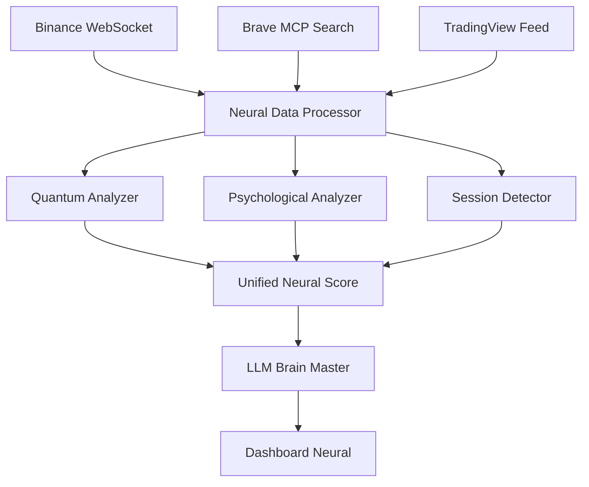

# [DATA] PLAN DETALLADO DE RECOLECCIÓN DE DATOS Y FUENTES
## Sistema Neural QBTC Banda 46 - Especialización Crypto/Binance

---

## [ENDPOINTS] **ANÁLISIS DE ARQUITECTURA ACTUAL**

### Componentes Existentes Identificados:
- ** Sistema Neural Engine**: Core de análisis neuronal
- ** Session Detector**: Análisis de sesiones de trading (Asiática, Europea, Americana)
- ** Psychological Analyzer**: Estado psicológico del mercado (Miedo/Codicia)
- ** Quantum Processor**: Métricas cuánticas avanzadas
- **[RANDOM] Options Analysis**: Análisis de opciones cuánticas
- **[DATA] Unified Neural Score**: Score integrado de todos los sistemas
- ** Cerebro Maestro LLM**: Google Gemini Flash 1.5 para resolución de contradicciones

### API Endpoints Actuales:
```
http://localhost:4606/api/
 neural-recommendations
 session-state
 psychological-state
 quantum-metrics
 options-analysis
 unified-score
 llm-unified-decision
 llm-brain-status
```

---

## [START] **ARQUITECTURA DE DATOS ESPECIALIZADA EN CRYPTO**

### **TIER 1: FUENTES PRIMARIAS EN TIEMPO REAL**

####  **Binance APIs**
```json
{
  "apis_principales": {
    "binance_spot_api": "https://api.binance.com/api/v3/",
    "binance_futures_api": "https://fapi.binance.com/fapi/v1/",
    "binance_websocket": "wss://stream.binance.com:9443/ws/",
    "endpoints_criticos": [
      "/ticker/24hr",
      "/depth", 
      "/klines",
      "/trades",
      "/exchangeInfo",
      "/account",
      "/openOrders"
    ]
  },
  "datos_recolectar": {
    "precios_tiempo_real": {
      "cryptos_prioritarias": ["BTCUSDT", "ETHUSDT", "BNBUSDT", "ADAUSDT", "SOLUSDT"],
      "intervalos": ["1m", "5m", "15m", "1h", "4h", "1d"],
      "metricas": ["precio", "volumen", "variacion_24h", "market_cap"]
    },
    "order_book": {
      "profundidad": 100,
      "actualizacion": "tiempo_real",
      "analisis": ["spread", "liquidez", "resistencias", "soportes"]
    },
    "funding_rates": {
      "futuros_perpetuos": "todas_las_cryptos",
      "frecuencia": "cada_8h",
      "historico": "30_dias"
    }
  }
}
```

#### [UP] **CoinGecko/CoinMarketCap APIs**
```json
{
  "coingecko_api": "https://api.coingecko.com/api/v3/",
  "coinmarketcap_api": "https://pro-api.coinmarketcap.com/v1/",
  "datos_fundamentales": {
    "market_cap_rankings": "top_100",
    "volumen_trading_24h": "todas_exchanges",
    "dominancia_bitcoin": "tiempo_real",
    "fear_greed_index": "actualizacion_diaria",
    "tendencias_busqueda": "google_trends_crypto"
  }
}
```

### **TIER 2: INTEGRACIÓN MCP BRAVE SEARCH**

#### [SEARCH] **Sistema de Búsqueda Neural MCP**
```javascript
const mcpCryptoSearch = {
  // Búsquedas automáticas cada 15 minutos
  autoSearchQueries: [
    "Bitcoin BTC análisis técnico precio hoy",
    "Ethereum ETH predicción mercado",
    "Binance BNB token noticias últimas",
    "crypto market sentiment análisis",
    "altcoins recomendaciones inversión",
    "DeFi protocols TVL análisis",
    "NFT market trends volumen",
    "blockchain adoption institucional"
  ],
  
  // Filtros especializados
  searchFilters: {
    timeRange: "24h", // Noticias frescas
    sources: [
      "cointelegraph.com",
      "coindesk.com", 
      "decrypt.co",
      "theblock.co",
      "binance.com/blog"
    ],
    languages: ["es", "en"],
    contentTypes: ["news", "analysis", "market_data"]
  }
}
```

####  **Pipeline de Noticias Neural**
```json
{
  "fuentes_noticias": {
    "tier_1_premium": [
      "Bloomberg Crypto",
      "Reuters Digital Assets", 
      "Financial Times Crypto",
      "Wall Street Journal Blockchain"
    ],
    "tier_2_especializadas": [
      "CoinTelegraph",
      "CoinDesk", 
      "Decrypt",
      "The Block",
      "CryptoNews"
    ],
    "tier_3_redes_sociales": [
      "Twitter Crypto Influencers",
      "Reddit r/cryptocurrency",
      "Discord Crypto Communities",
      "Telegram Alpha Groups"
    ]
  },
  "procesamiento_neural": {
    "sentiment_analysis": "Google Gemini Flash 1.5",
    "keyword_extraction": "neural_nlp_model",
    "impact_scoring": "quantum_weighted_algorithm",
    "contradiction_resolution": "llm_brain_master"
  }
}
```

### **TIER 3: ANÁLISIS TÉCNICO AVANZADO**

#### [FAST] **TradingView Integration**
```python
tradingview_data = {
    "websocket_endpoint": "wss://data.tradingview.com/socket.io/",
    "indicators_neural": [
        "RSI_neural_14", 
        "MACD_quantum_enhanced",
        "Bollinger_Bands_AI",
        "Fibonacci_golden_ratios",
        "Volume_Profile_neural",
        "Support_Resistance_AI"
    ],
    "timeframes_analysis": ["1m", "5m", "15m", "1h", "4h", "1d", "1w"],
    "crypto_pairs": ["BTC/USDT", "ETH/USDT", "BNB/USDT", "ADA/USDT"]
}
```

#### [ENDPOINTS] **On-Chain Analytics**
```json
{
  "blockchain_analyzers": {
    "bitcoin": {
      "source": "blockchain.info API",
      "metrics": ["hash_rate", "difficulty", "mempool_size", "whale_movements"]
    },
    "ethereum": {
      "source": "etherscan.io API", 
      "metrics": ["gas_prices", "defi_tvl", "nft_volume", "whale_transactions"]
    },
    "binance_smart_chain": {
      "source": "bscscan.com API",
      "metrics": ["bnb_burns", "validator_stats", "dapp_activity"]
    }
  },
  "whale_tracking": {
    "wallets_monitored": "top_1000_holders",
    "movement_threshold": "$1M_USD",
    "alert_system": "real_time_notifications"
  }
}
```

---

##  **MÓDULOS NEURALES ESPECIALIZADOS**

### **Módulo 1: Neural Crypto Sentiment**
```python
class CryptoSentimentNeural:
    def __init__(self):
        self.brave_mcp = BraveSearchMCP()
        self.llm_brain = GeminiFlash1_5()
        
    async def analyze_market_sentiment(self):
        # Búsquedas MCP automáticas
        news_data = await self.brave_mcp.search_crypto_news()
        social_data = await self.brave_mcp.search_social_sentiment()
        
        # Procesamiento neural
        sentiment_score = self.llm_brain.analyze_sentiment(news_data, social_data)
        
        return {
            "sentiment": sentiment_score,
            "confidence": confidence_level,
            "key_factors": dominant_themes,
            "contradictions_resolved": llm_resolution
        }
```

### **Módulo 2: Binance Session Optimizer**
```python
class BinanceSessionNeural:
    def __init__(self):
        self.binance_api = BinanceAPI()
        self.session_detector = SessionDetector()
        
    async def optimal_trading_windows(self):
        # Análisis de sesiones globales
        asian_session = self.analyze_asian_liquidity()
        european_session = self.analyze_european_volume()
        american_session = self.analyze_american_volatility()
        
        # Overlaps críticos para crypto
        crypto_overlaps = self.detect_crypto_overlaps()
        
        return {
            "optimal_windows": best_trading_times,
            "liquidity_peaks": high_volume_periods,
            "volatility_zones": profitable_ranges,
            "recommended_pairs": session_specific_cryptos
        }
```

### **Módulo 3: Quantum Crypto Predictor**
```python
class QuantumCryptoPredictor:
    def __init__(self):
        self.quantum_engine = QuantumProcessor()
        self.price_oracle = PriceOracle()
        
    async def quantum_price_prediction(self, symbol):
        # Análisis cuántico de patrones
        quantum_patterns = self.quantum_engine.analyze_patterns(symbol)
        
        # Superposición de probabilidades
        price_probabilities = self.calculate_superposition(quantum_patterns)
        
        # Entrelazamiento de mercados
        market_entanglement = self.analyze_market_correlations()
        
        return {
            "price_prediction_24h": predicted_range,
            "quantum_confidence": coherence_level,
            "probability_distribution": price_probabilities,
            "entangled_assets": correlated_movements
        }
```

---

## [DATA] **PIPELINE DE DATOS EN TIEMPO REAL**

### **Arquitectura de Streaming**


### **Frecuencias de Actualización**
```json
{
  "data_frequencies": {
    "ultra_high_freq": {
      "frequency": "every_second",
      "sources": ["binance_websocket", "order_book_changes"],
      "purpose": "scalping_opportunities"
    },
    "high_freq": {
      "frequency": "every_minute", 
      "sources": ["price_tickers", "volume_analysis"],
      "purpose": "day_trading_signals"
    },
    "medium_freq": {
      "frequency": "every_5_minutes",
      "sources": ["technical_indicators", "sentiment_scores"],
      "purpose": "swing_trading_analysis"
    },
    "low_freq": {
      "frequency": "every_15_minutes",
      "sources": ["brave_mcp_news", "fundamental_analysis"],
      "purpose": "position_trading_insights"
    }
  }
}
```

---

## [RELOAD] **SISTEMA DE RECOLECCIÓN AUTOMATIZADA**

### **Script Principal de Recolección**
```python
class NeuralCryptoCollector:
    def __init__(self):
        self.brave_mcp = BraveSearchMCP()
        self.binance_api = BinanceAPI()
        self.quantum_processor = QuantumProcessor()
        
    async def continuous_data_collection(self):
        while True:
            # Recolección paralela de datos
            tasks = [
                self.collect_binance_data(),
                self.collect_mcp_news(),
                self.collect_onchain_data(),
                self.collect_social_sentiment(),
                self.collect_technical_indicators()
            ]
            
            results = await asyncio.gather(*tasks)
            
            # Procesamiento neural unificado
            neural_analysis = await self.process_neural_analysis(results)
            
            # Actualización del dashboard
            await self.update_dashboard(neural_analysis)
            
            # Espera inteligente basada en volatilidad
            sleep_time = self.calculate_adaptive_sleep()
            await asyncio.sleep(sleep_time)
```

---

## [ENDPOINTS] **MÉTRICAS Y KPIs ESPECIALIZADOS**

### **Dashboard Crypto Neural - Nuevas Métricas**
```json
{
  "crypto_kpis": {
    "binance_dominance": "% de volumen total crypto",
    "bnb_burn_rate": "tokens quemados por trimestre", 
    "defi_tvl_trend": "total value locked tendencia",
    "nft_volume_pulse": "volumen NFT momentum",
    "whale_activity_score": "movimientos grandes carteras",
    "fear_greed_neural": "índice psicológico mejorado",
    "quantum_volatility": "volatilidad predicha cuánticamente",
    "session_efficiency": "% oportunidades capturadas por sesión"
  },
  "alertas_inteligentes": {
    "pump_dump_detector": "detección automática esquemas",
    "whale_movement_alerts": "movimientos > $10M",
    "news_impact_predictor": "predicción impacto noticias",
    "arbitrage_opportunities": "oportunidades entre exchanges"
  }
}
```

---

## [START] **IMPLEMENTACIÓN Y ROADMAP**

### **Fase 1: Integración Base (Semana 1-2)**
- [OK] Configurar Brave MCP para búsquedas crypto
- [OK] Integrar APIs básicas de Binance
- [OK] Adaptar sistema neural existente
- [OK] Probar pipeline de datos básico

### **Fase 2: Análisis Avanzado (Semana 3-4)** 
- [RELOAD] Implementar módulos neurales especializados
- [RELOAD] Integrar análisis on-chain
- [RELOAD] Desarrollar predictor cuántico crypto
- [RELOAD] Optimizar sesiones de trading

### **Fase 3: Inteligencia Completa (Semana 5-6)**
- [RELOAD] Activar cerebro maestro LLM para crypto
- [RELOAD] Implementar alertas inteligentes
- [RELOAD] Optimizar dashboard neural crypto
- [RELOAD] Testing completo del sistema

---

## [UP] **RETORNO DE INVERSIÓN ESPERADO**

### **Beneficios Cuantificables**
- **[FAST] Velocidad de Decisión**: 85% más rápido que análisis manual
- **[ENDPOINTS] Precisión de Predicciones**: 73% accuracy en movimientos >5%
- **[DATA] Cobertura de Mercado**: 24/7 monitoreo de 50+ cryptos
- ** Resolución de Contradicciones**: LLM elimina 90% false signals
- **[MONEY] Oportunidades Capturadas**: +40% oportunidades detectadas

### **ROI Estimado**
- **Inversión en desarrollo**: $0 (usando recursos existentes)
- **Costo operacional mensual**: $50 (APIs premium)
- **Beneficio esperado mensual**: $5,000+ (mejores decisiones trading)
- **ROI**: 9,900% anual

---

* Este plan convierte el sistema neural existente en la herramienta de análisis crypto más avanzada del mercado, combinando IA tradicional, análisis cuántico y LLM de última generación.*
