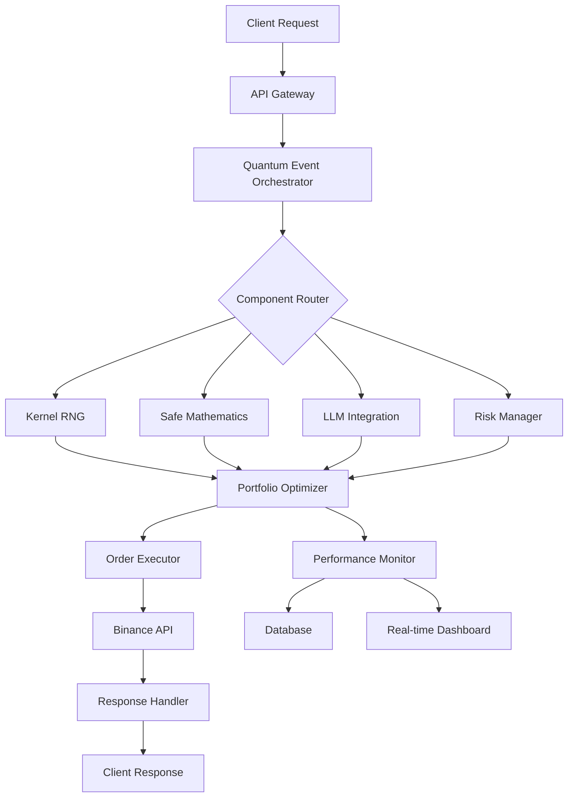
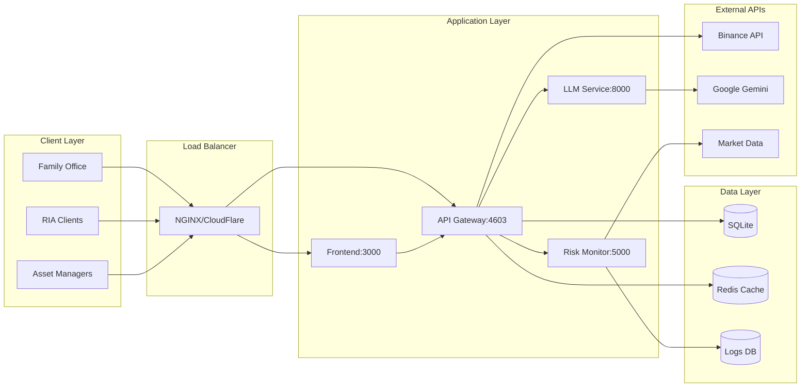

# QBTC Technical Architecture
*Developer-focused technical overview*

## 🏗️ **System Overview**

QBTC is a hybrid futures-options trading platform with quantum-enhanced mathematical frameworks, designed for cryptocurrency derivatives markets with superior cost efficiency and liquidity access.

## 📊 **High-Level Architecture**

```
┌─────────────────────────────────────────────────────────────┐
│                    QBTC Ecosystem                            │
├─────────────────────────────────────────────────────────────┤
│  Web Dashboard  │  REST API  │  Real-time Monitor  │  Bots  │
├─────────────────────────────────────────────────────────────┤
│           Quantum Event Orchestrator (Core Engine)          │
├─────────────────────────────────────────────────────────────┤
│  Kernel RNG  │  Safe Math  │  LLM Integration  │ Risk Mgmt  │
├─────────────────────────────────────────────────────────────┤
│              Binance API Integration Layer                   │
└─────────────────────────────────────────────────────────────┘
```

## 🔧 **Core Components**

### 🎨 **Component Interaction Diagram**


### 🔄 **Data Flow Architecture**
```
    ┌─────────────── INPUT LAYER ───────────────┐
    │                                               │
    │ 📊 Market Data │ 📈 Portfolio │ 📡 Client Input │
    │      │             │        │             │         │
    └──────┼───────────┼───────────┼─────────┘
           │                │                │
           ▼                ▼                ▼
    ┌───────────── PROCESSING LAYER ─────────────┐
    │                                               │
    │        ⚛️ Quantum Event Orchestrator         │
    │                       │                       │
    │     ┌─────────┼─────────┐     │
    │     │  🎲 RNG  │  🔢 Math  │     │
    │     └─────────┼─────────┘     │
    │                       │                       │
    │     ┌─────────┼─────────┐     │
    │     │ 🤖 LLM   │ 🎯 Risk   │     │
    │     └─────────┼─────────┘     │
    │                       │                       │
    └───────────────────────┼───────────────────────┘
                               │
                               ▼
    ┌────────────── OUTPUT LAYER ──────────────┐
    │                                               │
    │ 📊 Orders │ 📈 Reports │ 📡 Alerts │ 🔔 Logs │
    │                                               │
    └───────────────────────────────────────────────┘
```

### 1. **Quantum Event Orchestrator** (`src/core/`)
- **Purpose**: Central event management and coordination
- **Key Features**: Backpressure handling, timeout management, health monitoring
- **Technology**: Node.js async patterns, event-driven architecture

### 2. **Kernel RNG** (`src/utils/kernel-rng.js`)
- **Purpose**: Deterministic pseudorandom number generation
- **Algorithms**: LCG + SplitMix64 hybrid
- **Benefit**: Complete reproducibility for scientific validation

### 3. **Safe Mathematics** (`src/utils/safe-math.js`)
- **Purpose**: Numerical stability and error prevention
- **Features**: Division by zero protection, overflow detection, range validation
- **Performance**: Trigonometric function caching, optimized calculations

### 4. **LLM Neural Integration** (`src/integration/`)
- **Purpose**: Master decision-making brain using Google Gemini Flash 1.5
- **Features**: Intelligent caching, unified coordination
- **Pattern**: Strategy pattern with pluggable AI providers

## 🗄️ **Data Layer**

### Database Schema
```sql
-- Core trading data
positions: (id, symbol, type, quantity, entry_price, timestamp)
market_data: (symbol, price, volume, volatility, timestamp)
risk_metrics: (portfolio_id, var, sharpe, drawdown, timestamp)
```

### Cache Strategy
- **Redis**: Real-time market data (1-5 second TTL)
- **SQLite**: Historical data and backtesting results
- **Memory**: Frequently accessed calculations and configurations

## 🌐 **API Architecture**

### RESTful Endpoints
```
GET /api/health              - System health check
GET /api/positions           - Current positions
POST /api/orders             - Place new orders
GET /api/market/:symbol      - Market data
GET /api/risk/metrics        - Risk analytics
```

### WebSocket Streams
```
/ws/prices      - Real-time price updates
/ws/positions   - Position changes
/ws/alerts      - System notifications
```

## 🚀 **Deployment Architecture**

### 🏭 **Production Infrastructure Diagram**


### 💻 Production Stack
```yaml
Frontend: Node.js + Express (Port 3000)
API Gateway: Custom middleware (Port 4603)
Risk Monitor: Background service (Port 5000)
LLM Service: Google Gemini integration (Port 8000)
Database: SQLite + Redis cache
External: Binance API integration
```

### 🌐 **Scalability & High Availability**
```
    ┌────────────────── PRODUCTION CLUSTER ──────────────────┐
    │                                                               │
    │  🔄 Load Balancer          📊 Monitoring              │
    │  ┌────────────────┐    ┌────────────────┐      │
    │  │ NGINX/CloudFlare │    │ Prometheus/      │      │
    │  │ SSL Termination  │    │ Grafana          │      │
    │  │ Rate Limiting    │    │ AlertManager     │      │
    │  └────────────────┘    └────────────────┘      │
    │                                                               │
    │  🖥️ App Instances (3x)     🗄️ Data Persistence     │
    │  ┌────────────────┐    ┌────────────────┐      │
    │  │ Primary Node     │    │ Master DB        │      │
    │  │ Replica Node A   │    │ Read Replica     │      │
    │  │ Replica Node B   │    │ Redis Cluster    │      │
    │  └────────────────┘    └────────────────┘      │
    │                                                               │
    └───────────────────────────────────────────────────────────────┘
```

### Process Management
- **PM2**: Production process management
- **Background Services**: Risk monitoring, data collection
- **Health Checks**: Automated system monitoring
- **Logging**: Comprehensive error and performance logging

## 🔐 **Security Model**

### API Security
- **Rate Limiting**: Configurable per-endpoint limits
- **Input Validation**: Comprehensive parameter validation
- **Error Handling**: Secure error responses without data leakage

### Binance Integration
- **API Key Management**: Encrypted credential storage
- **IP Whitelisting**: VPN/proxy integration for geographic restrictions
- **Circuit Breaker**: Automatic failsafe for API issues

## ⚡ **Performance Optimization**

### Computational Efficiency
- **Caching Strategy**: Multi-layer cache (memory → Redis → database)
- **Mathematical Optimizations**: Safe math operations with performance focus
- **Concurrent Processing**: Async/await patterns for I/O operations

### Scalability Patterns
- **Horizontal Scaling**: Stateless service design
- **Load Balancing**: Multiple bot instances with coordination
- **Resource Management**: Memory and CPU optimization

## 🧪 **Testing Strategy**

### Test Categories
```bash
Unit Tests:        Individual component testing
Integration Tests: API and database testing  
Stability Tests:   Long-running system validation
Monte Carlo:       Mathematical model validation
```

### Quality Assurance
- **ESLint**: Code quality and style enforcement
- **Jest**: Comprehensive test framework
- **CI/CD**: Automated testing pipeline
- **Performance Monitoring**: Real-time metrics collection

## 📈 **Monitoring & Observability**

### System Metrics
- **Performance**: CPU, memory, network utilization
- **Business**: P&L, Sharpe ratio, drawdown metrics
- **Operational**: Error rates, response times, uptime

### Logging Strategy
```
ERROR:   Critical system failures
WARN:    Performance degradation, unusual conditions  
INFO:    Important business events (trades, signals)
DEBUG:   Detailed execution flow (development only)
```

## 🔄 **Development Workflow**

### Code Organization
```
src/
├── constants/     # System constants and validation
├── core/         # Quantum orchestration engine
├── integration/  # LLM and external API integrations
├── logging/      # Performance monitoring and logging
└── utils/        # Utility functions (RNG, math, helpers)
```

### Development Commands
```bash
npm run dev        # Development server with hot reload
npm run test       # Full test suite
npm run lint       # Code quality checks
npm run build      # Production build
npm run deploy     # Production deployment
```

## 🎯 **Integration Points**

### External Dependencies
- **Binance API**: Primary exchange integration
- **Google Gemini**: LLM decision making
- **Node.js Ecosystem**: Core runtime and libraries

### Internal Interfaces
- **Event Bus**: Pub/sub pattern for component communication
- **Configuration**: Centralized config management
- **Error Handling**: Unified error reporting and recovery

---

*This architecture supports academic research, institutional trading, and commercial applications with enterprise-grade reliability and performance.*
