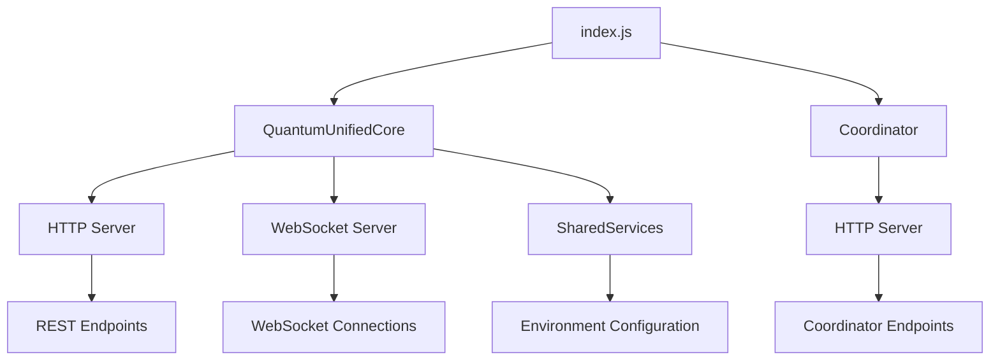

# VigoFutures - Project Inventory (Catastro)

## Project Overview

**Project Name:** VigoFutures  
**Version:** 1.0.0  
**Type:** Unified Quantum Core + Coordinator System  
**Language:** Node.js (JavaScript)  
**Architecture:** Standalone Microservices  

### Specific Purpose
VigoFutures is a unified launcher system that combines a Quantum Core service with an optional Coordinator service. It's designed to operate as a standalone system without external dependencies, providing both REST API endpoints and WebSocket capabilities for real-time communication.

## System Architecture



## Components

### 1. Main Entry Point
- **File:** [`index.js`](index.js)
- **Purpose:** Unified launcher that initializes and coordinates all services
- **Key Functions:**
  - Environment variable loading
  - Port validation
  - Service initialization (Quantum Core and optional Coordinator)
  - Graceful shutdown handling

### 2. Quantum Core Module
- **Location:** [`quantum-core/QuantumUnifiedCore.js`](quantum-core/QuantumUnifiedCore.js)
- **Purpose:** Core service providing HTTP REST API and WebSocket capabilities
- **Key Features:**
  - HTTP server with health check endpoint
  - Native WebSocket implementation (no external dependencies)
  - Client connection management
  - Message echo functionality

### 3. Coordinator Module
- **Location:** [`coordinator/index.js`](coordinator/index.js)
- **Purpose:** Optional coordination service providing monitoring and metrics
- **Key Features:**
  - Health monitoring
  - Service information
  - System metrics (uptime, memory usage, PID)

### 4. Shared Services
- **Location:** [`quantum-core/services/SharedServices.js`](quantum-core/services/SharedServices.js)
- **Purpose:** Common utilities shared across components
- **Key Features:**
  - Environment variable loading from .env files
  - Configuration management

## Servers and Endpoints

### Quantum Core Server
- **Default Port:** 18020 (configurable via `UNIFIED_SERVER_PORT`)
- **Protocol:** HTTP + WebSocket
- **Endpoints:**
  - `GET /health` - Health check endpoint
  - `WS /ws` - WebSocket endpoint for real-time communication

### Coordinator Server (Optional)
- **Default Port:** 3000 (configurable via `COORDINATOR_PORT`)
- **Protocol:** HTTP
- **Endpoints:**
  - `GET /health` - Service health status
  - `GET /info` - Service information and metadata
  - `GET /metrics` - System performance metrics

## Configuration Options

### Environment Variables
- `UNIFIED_SERVER_PORT` - Port for Quantum Core server (default: 18020)
- `SINGLE_SERVER_MODE` - Controls Coordinator startup (default: true)
  - `true` - Only Quantum Core runs
  - `false` - Both Quantum Core and Coordinator run
- `COORDINATOR_PORT` - Port for Coordinator server (default: 3000)

### Configuration Files
- `.env` file in `quantum-core/` directory (optional)
- Example configuration available in `quantum-core/env-example.txt`

## Deployment Requirements

### System Requirements
- Node.js 16+ (engines specified in package.json)
- No external npm dependencies required (standalone mode)
- Operating System: Any platform supporting Node.js

### Deployment Modes
1. **Standalone Mode (Recommended)**
   - No npm install required
   - Uses only native Node.js modules
   - Command: `node index.js`

2. **Development Mode**
   - Allows external dependencies
   - Command: `npm run start`

### Port Configuration
- Quantum Core: Default 18020
- Coordinator: Default 3000 (when enabled)
- Both ports are configurable via environment variables

## Technical Implementation Details

### WebSocket Implementation
- Custom WebSocket protocol implementation
- No external WebSocket libraries required
- Supports:
  - Handshake protocol
  - Frame encoding/decoding
  - Message echo functionality
  - Client connection management

### Error Handling
- Port validation with fallback mechanisms
- Graceful shutdown on SIGINT/SIGTERM
- Comprehensive logging with timestamps
- Service isolation (failure in one service doesn't affect others)

### Logging System
- Simple built-in logger
- Timestamp formatting
- Log levels (info, warn, error)
- Console output only

## Security Considerations

### CORS Configuration
- Coordinator service includes CORS headers
- Allows cross-origin requests from any domain
- Supports GET, POST, and OPTIONS methods

### Environment Security
- Environment variables loaded from .env files
- Existing process.env variables take precedence
- No sensitive data logged

## Performance Characteristics

### Memory Usage
- Minimal memory footprint
- No external dependencies reduce memory overhead
- WebSocket client connections managed efficiently

### Scalability
- Single-threaded Node.js architecture
- Suitable for small to medium workloads
- WebSocket connections handled efficiently

## Monitoring and Observability

### Health Checks
- Both services provide `/health` endpoints
- JSON response format
- Service identification in responses

### Metrics Collection
- Coordinator provides system metrics:
  - Uptime
  - Memory usage
  - Process ID
  - Service information

## Development and Testing

### Quick Start
```bash
cd VigoFutures
node index.js
```

### Testing Endpoints
- Quantum Core Health: `http://localhost:18020/health`
- WebSocket Test: Connect to `ws://localhost:18020/ws`
- Coordinator Health: `http://localhost:3000/health` (when enabled)

### Development Configuration
- Set `SINGLE_SERVER_MODE=false` to enable Coordinator
- Modify ports via environment variables
- Use local .env file for configuration

## Project Structure

```
VigoFutures/
├── index.js                 # Main entry point
├── package.json            # Project metadata
├── README.md               # Documentation
├── coordinator/            # Coordinator service
│   └── index.js           # Coordinator implementation
└── quantum-core/          # Quantum Core service
    ├── QuantumUnifiedCore.js  # Core service implementation
    └── services/          # Shared utilities
        └── SharedServices.js  # Environment management
```

## Maintenance and Operations

### Service Management
- Services can be started/stopped independently
- Graceful shutdown handling
- Process monitoring recommended for production

### Configuration Management
- Environment-based configuration
- Optional .env file support
- Port configuration validation

### Backup and Recovery
- No persistent data storage
- Configuration files should be backed up
- Stateless service design simplifies recovery

## Future Enhancements

### Potential Improvements
- Add persistent storage capabilities
- Implement authentication/authorization
- Add more comprehensive metrics
- Implement service discovery
- Add load balancing capabilities

### Extensibility Points
- Modular service architecture
- Shared services for common functionality
- Environment-based configuration
- WebSocket protocol extensibility