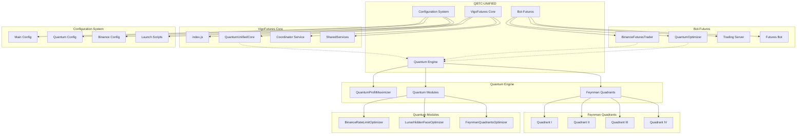
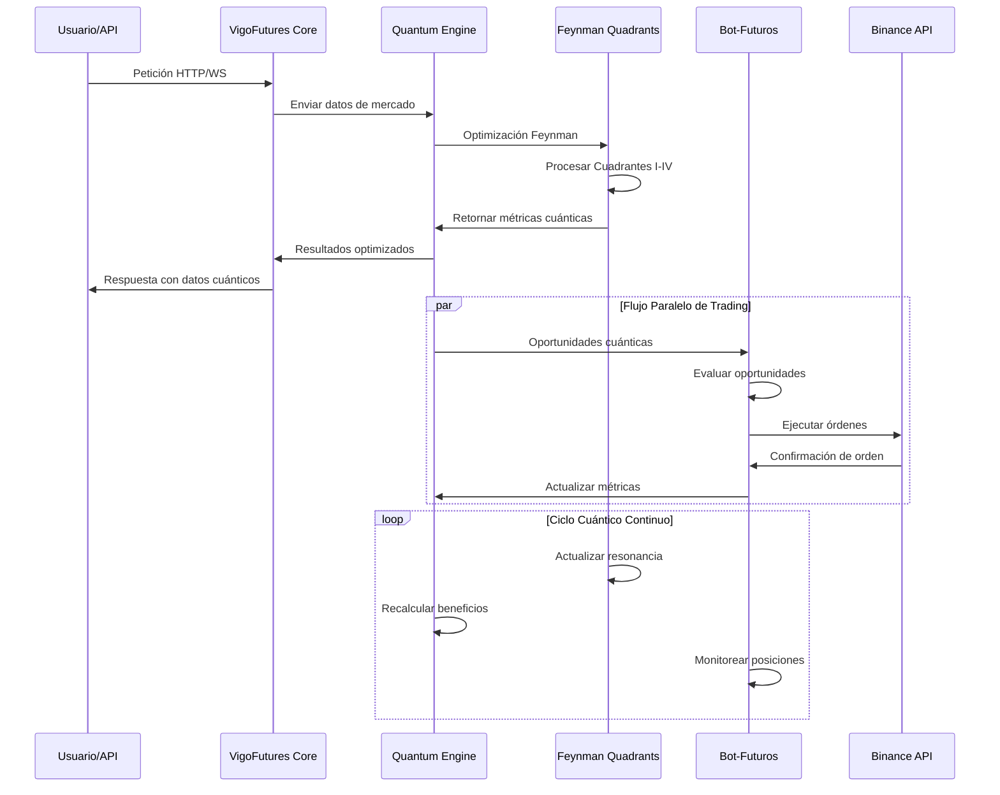
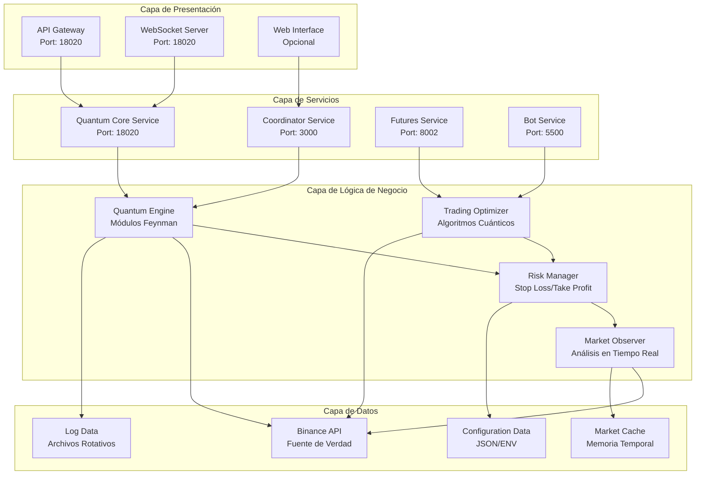
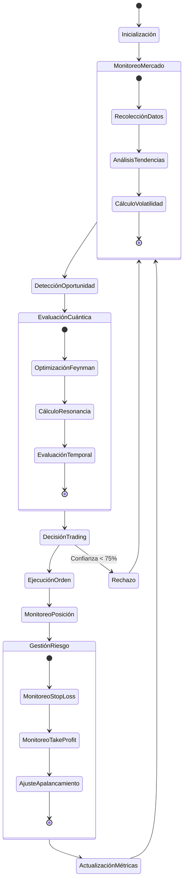
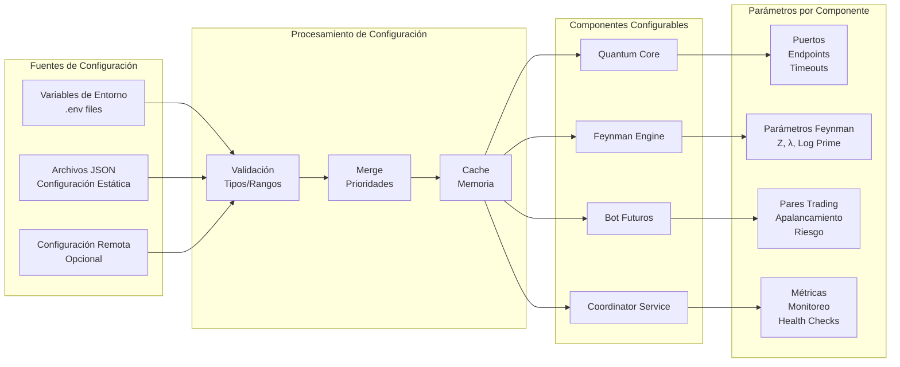
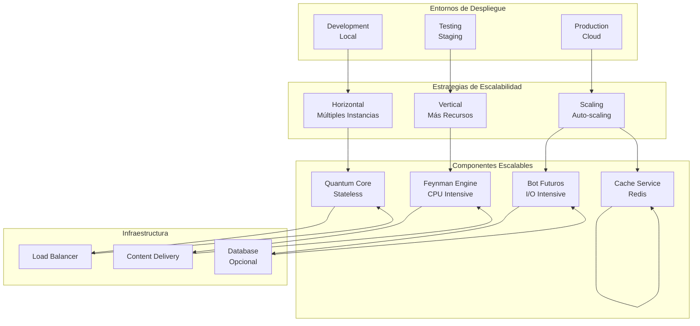

# QBTC-UNIFIED - Diagramas de Arquitectura

## 1. Arquitectura General del Sistema



## 2. Flujo de Datos Cuántico



## 3. Arquitectura de Cuadrantes Feynman

```mermaid
graph LR
    subgraph "Plano Complejo Feynman"
        QI[Quadrant I<br/>Superior Derecho<br/>Optimización Apalancamiento]
        QII[Quadrant II<br/>Superior Izquierdo<br/>Optimización Rate Limits]
        QIII[Quadrant III<br/>Inferior Izquierdo<br/>Procesamiento Datos]
        QIV[Quadrant IV<br/>Inferior Derecho<br/>Optimización Temporal]
    end
    
    subgraph "Parámetros Cuánticos"
        Z[Z = 9 + 16j]
        L[λ = 888MHz]
        P[ln(7919) = 8.9769]
        M[Multiplicador Zurita = 7919]
    end
    
    subgraph "Flujo de Optimización"
        O1[Entrada de Datos<br/>Mercado Binance]
        O2[Procesamiento Cuántico]
        O3[Optimización por Cuadrante]
        O4[Síntesis de Resultados]
        O5[Salida Optimizada]
    end
    
    O1 --> O2
    O2 --> O3
    O3 --> QI
    O3 --> QII
    O3 --> QIII
    O3 --> QIV
    QI --> O4
    QII --> O4
    QIII --> O4
    QIV --> O4
    O4 --> O5
    
    Z --> QI
    Z --> QII
    Z --> QIII
    Z --> QIV
    L --> QI
    L --> QII
    P --> QIII
    P --> QIV
    M --> O4
```

## 4. Integración con Binance API

```mermaid
graph TB
    subgraph "QBTC-UNIFIED System"
        Q[Quantum Engine]
        B[Bot-Futuros]
        R[Rate Limit Optimizer]
        L[Lunar Optimizer]
    end
    
    subgraph "Binance API"
        BA[REST API]
        BW[WebSocket Streams]
        BF[Futures API]
        BM[Market Data]
    end
    
    subgraph "Flujo de Datos"
        D1[Market Data<br/>Precio/Volumen/Volatilidad]
        D2[Order Execution<br/>Comprar/Vender]
        D3[Position Management<br/>Apalancamiento/Riesgo]
        D4[Account Data<br/>Balance/PnL]
    end
    
    Q --> R
    B --> R
    R --> BA
    BA --> D1
    D1 --> Q
    D1 --> B
    
    B --> BF
    BF --> D2
    D2 --> BM
    BM --> B
    
    L --> BW
    BW --> D3
    D3 --> B
    
    B --> BA
    BA --> D4
    D4 --> B
    
    loop Ciclo de Optimización
        Q --> L
        L --> temporal_advantage
        temporal_advantage --> B
        B --> execution_feedback
        execution_feedback --> Q
    end
```

## 5. Arquitectura de Microservicios



## 6. Flujo de Trading Cuántico



## 7. Arquitectura de Configuración



## 8. Arquitectura de Logging y Monitorización

```mermaid
graph TB
    subgraph "Fuentes de Logs"
        QL[Quantum Engine Logs]
        FL[Feynman Logs]
        BL[Bot Logs]
        SL[System Logs]
    end
    
    subgraph "Procesamiento de Logs"
        C[Colector de Logs]
        P[Procesador<br/>Timestamp/Level]
        F[Filtro<br/>Componente/Severidad]
        S[Storage<br/>Archivos]
    end
    
    subgraph "Métricas Cuánticas"
        QM[Métricas Feynman<br/>Eficiencia Cuadrantes]
        RM[Métricas Rendimiento<br/>Latencia/Throughput]
        TM[Métricas Trading<br/>PnL/Éxito]
        CM[Métricas Consciencia<br/>Nivel Evolución]
    end
    
    subgraph "Monitorización"
        H[Health Checks]
        A[Alertas<br/>Umbrales]
        D[Dashboard<br/>Visualización]
        R[Reportes<br/>Históricos]
    end
    
    QL --> C
    FL --> C
    BL --> C
    SL --> C
    
    C --> P
    P --> F
    F --> S
    
    P --> QM
    P --> RM
    P --> TM
    P --> CM
    
    QM --> H
    RM --> A
    TM --> D
    CM --> R
    
    loop Ciclo de Monitorización
        H --> A
        A --> D
        D --> R
    end
```

## 9. Despliegue y Escalabilidad



## 10. Seguridad y Gestión de Riesgo

```mermaid
graph TB
    subgraph "Capa de Seguridad"
        AUTH[Autenticación<br/>API Keys]
        CRYPT[Encriptación<br/>HMAC-SHA256]
        CORS[CORS<br/>Orígenes Permitidos]
        VAL[Validación<br/>Input/Output]
    end
    
    subgraph "Gestión de Riesgo"
        SL[Stop Loss<br/>Dinámico]
        TP[Take Profit<br/>Automático]
        LV[Leverage Control<br/>Máximos]
        PS[Position Sizing<br/>Porcentaje]
    end
    
    subgraph "Monitoreo de Seguridad"
        AM[Activity Monitor<br/>Logs Auditoría]
        AA[Alert Analysis<br/>Anomalías]
        IR[Incident Response<br/>Automatizado]
        RR[Recovery<br/>Automático]
    end
    
    subgraph "Protección de Datos"
        API[API Keys<br/>Secret Management]
        CFG[Configuración<br/>Variables Entorno]
        LOG[Logs<br/>Sin Datos Sensibles]
        ENC[Encriptación<br/>En Tránsito/Reposo]
    end
    
    AUTH --> CRYPT
    CRYPT --> CORS
    CORS --> VAL
    
    VAL --> SL
    SL --> TP
    TP --> LV
    LV --> PS
    
    PS --> AM
    AM --> AA
    AA --> IR
    IR --> RR
    
    RR --> API
    API --> CFG
    CFG --> LOG
    LOG --> ENC
    
    loop Ciclo Continuo
        AM --> AA
        AA --> IR
        IR --> RR
        RR --> AM
    end
```

## Resumen de Diagramas

Estos diagramas proporcionan una visión completa de la arquitectura de QBTC-UNIFIED:

1. **Arquitectura General**: Muestra la estructura de alto nivel y las relaciones entre componentes principales.
2. **Flujo de Datos Cuántico**: Ilustra cómo fluyen los datos a través del sistema cuántico.
3. **Cuadrantes Feynman**: Detalla la implementación de los cuatro cuadrantes de optimización.
4. **Integración Binance**: Muestra cómo el sistema se integra con la API de Binance.
5. **Microservicios**: Presenta la arquitectura de microservicios del sistema.
6. **Flujo de Trading**: Describe el ciclo completo de trading cuántico.
7. **Configuración**: Explica cómo se gestiona la configuración en todo el sistema.
8. **Logging y Monitorización**: Muestra la arquitectura de monitorización y logging.
9. **Despliegue**: Ilustra las estrategias de despliegue y escalabilidad.
10. **Seguridad**: Detalla las capas de seguridad y gestión de riesgo.

Cada diagrama está diseñado para proporcionar una perspectiva diferente del sistema, permitiendo una comprensión completa de la arquitectura y el funcionamiento de QBTC-UNIFIED.