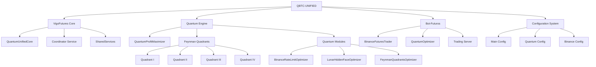

# QBTC-UNIFIED - Catastro Completo de Componentes

## Visión General del Proyecto

**Nombre del Proyecto:** QBTC-UNIFIED  
**Versión:** 1.0.0  
**Tipo:** Sistema Unificado de Trading Cuántico con Optimización Feynman  
**Lenguaje:** Node.js (JavaScript)  
**Arquitectura:** Microservicios Cuánticos Independientes  

### Propósito Específico
QBTC-UNIFIED es un sistema integral de trading cuántico que combina múltiples capas de optimización incluyendo algoritmos Feynman, procesamiento cuántico y trading automatizado en Binance. El sistema está diseñado para operar como una plataforma unificada con componentes independientes que pueden funcionar de manera autónoma.

## Arquitectura del Sistema



## Inventario Detallado de Componentes

### 1. Sistema Principal VigoFutures

#### 1.1 Punto de Entrada Principal
- **Archivo:** [`index.js`](index.js)
- **Propósito:** Lanzador unificado que inicializa y coordina todos los servicios
- **Funciones Clave:**
  - Carga de variables de entorno
  - Validación de puertos
  - Inicialización de servicios (Quantum Core y Coordinator opcional)
  - Manejo de apagado graceful
- **Dependencias:** Módulos nativos de Node.js (standalone)
- **Configuración:** `UNIFIED_SERVER_PORT`, `SINGLE_SERVER_MODE`, `COORDINATOR_PORT`

#### 1.2 Quantum Core
- **Archivo:** [`quantum-core/QuantumUnifiedCore.js`](quantum-core/QuantumUnifiedCore.js)
- **Propósito:** Servicio principal que proporciona API REST y capacidades WebSocket
- **Características Clave:**
  - Servidor HTTP con endpoint de health check
  - Implementación WebSocket nativa (sin dependencias externas)
  - Gestión de conexiones de clientes
  - Funcionalidad de echo de mensajes
- **Protocolos:** HTTP + WebSocket
- **Endpoints:** `GET /health`, `WS /ws`

#### 1.3 Coordinator Service
- **Archivo:** [`coordinator/index.js`](coordinator/index.js)
- **Propósito:** Servicio opcional de coordinación que proporciona monitoreo y métricas
- **Características Clave:**
  - Monitoreo de salud
  - Información de servicios
  - Métricas del sistema (uptime, uso de memoria, PID)
- **Endpoints:** `GET /health`, `GET /info`, `GET /metrics`
- **CORS:** Habilitado para todos los orígenes

#### 1.4 Shared Services
- **Archivo:** [`quantum-core/services/SharedServices.js`](quantum-core/services/SharedServices.js)
- **Propósito:** Utilidades comunes compartidas entre componentes
- **Funciones:**
  - Carga de variables de entorno desde archivos .env
  - Gestión de configuración
- **Independencia:** Funciona sin dependencias externas

### 2. Quantum Engine con Optimización Feynman

#### 2.1 Quantum Profit Maximizer
- **Archivo:** [`core/quantum-engine/QuantumProfitMaximizer.js`](core/quantum-engine/QuantumProfitMaximizer.js)
- **Propósito:** Optimizador de beneficios cuánticos usando algoritmos Feynman
- **Parámetros Clave:**
  - `targetProfitPerSecond`: 0.015
  - `maxSimultaneousStreams`: 372
  - `leverageMultiplier`: 7.919
  - `zuritaMultiplier`: 7919
  - `feynmanParams`: {complex_z: {real: 9, imaginary: 16}, lambda_mhz: 888}
- **Funciones:**
  - `maximizeQuantumProfits()`: Calcula beneficios cuánticos optimizados
  - `optimizeLeverageQuantum()`: Optimiza apalancamiento usando plano complejo
  - `getFeynmanQuadrantEfficiency()`: Calcula eficiencia por cuadrante

#### 2.2 Módulos Cuánticos

##### 2.2.1 Feynman Quadrants Optimizer
- **Archivo:** [`core/quantum-engine/modules/FeynmanQuadrantsOptimizer.js`](core/quantum-engine/modules/FeynmanQuadrantsOptimizer.js)
- **Propósito:** Optimización basada en cuadrantes de Feynman
- **Parámetros:**
  - `z_optimal`: {real: 9, imaginary: 16}
  - `lambda_mhz`: 888
  - `log_prime`: Math.log(7919)
- **Funciones:**
  - `optimizeLeverage()`: Optimización de apalancamiento cuántico
  - `getComplexPlaneMaximum()`: Máximo en plano complejo
  - `optimizeBinanceRateLimits()`: Optimización específica para Binance

##### 2.2.2 Binance Rate Limit Optimizer
- **Archivo:** [`core/quantum-engine/modules/BinanceRateLimitOptimizer.js`](core/quantum-engine/modules/BinanceRateLimitOptimizer.js)
- **Propósito:** Optimización de límites de tasa para API de Binance
- **Parámetros:**
  - `maxRequestsPerMinute`: 1200
  - `compressionRatio`: 16.8
  - `batchSize`: 49
- **Funciones:**
  - `optimizeRequests()`: Optimiza número de solicitudes
  - `getMaxConcurrentStreams()`: Calcula streams máximos concurrentes
  - `calculateRequestWeight()`: Calcula peso de solicitudes por endpoint

##### 2.2.3 Lunar Hidden Face Optimizer
- **Archivo:** [`core/quantum-engine/modules/LunarHiddenFaceOptimizer.js`](core/quantum-engine/modules/LunarHiddenFaceOptimizer.js)
- **Propósito:** Optimización con ventaja trans-temporal usando cara oculta lunar
- **Parámetros:**
  - `temporalAdvantageMs`: -3000
  - `gravityMultiplier`: 1.618
  - `lunarPhases`: ['new', 'waxing', 'full', 'waning']
- **Funciones:**
  - `predictMarketMovement()`: Predicción basada en fases lunares
  - `generateGravitationalWaves()`: Genera ondas gravitacionales
  - `optimizeOrderExecution()`: Optimiza ejecución de órdenes
  - `calculateQuantumAdvantage()`: Calcula ventaja cuántica

#### 2.3 Cuadrantes Feynman

##### 2.3.1 Cuadrante I - Plano Complejo Superior Derecho
- **Archivo:** [`core/quantum-engine/quadrants/feynman-q1-binance.js`](core/quantum-engine/quadrants/feynman-q1-binance.js)
- **Enfoque:** Optimización de apalancamiento
- **Estrategia:** Agresiva
- **Nivel de Riesgo:** 0.15
- **Símbolos:** Top 10
- **Ciclo:** 15 segundos

##### 2.3.2 Cuadrante II - Plano Complejo Superior Izquierdo
- **Archivo:** [`core/quantum-engine/quadrants/feynman-q2-binance.js`](core/quantum-engine/quadrants/feynman-q2-binance.js)
- **Enfoque:** Optimización de límites de tasa
- **Estrategia:** Balanceada
- **Nivel de Riesgo:** 0.10
- **Símbolos:** Todos
- **Ciclo:** 15 segundos

##### 2.3.3 Cuadrante III - Plano Complejo Inferior Izquierdo
- **Archivo:** [`core/quantum-engine/quadrants/feynman-q3-binance.js`](core/quantum-engine/quadrants/feynman-q3-binance.js)
- **Enfoque:** Procesamiento de datos
- **Estrategia:** Analítica
- **Nivel de Riesgo:** 0.08
- **Símbolos:** Todos
- **Ciclo:** 15 segundos

##### 2.3.4 Cuadrante IV - Plano Complejo Inferior Derecho
- **Archivo:** [`core/quantum-engine/quadrants/feynman-q4-binance.js`](core/quantum-engine/quadrants/feynman-q4-binance.js)
- **Enfoque:** Optimización temporal
- **Estrategia:** Predictiva
- **Nivel de Riesgo:** 0.12
- **Símbolos:** Top 20
- **Ciclo:** 15 segundos

#### 2.4 Métricas Cuánticas
- **Archivo:** [`core/quantum-engine/quadrants/quantum-binance-metrics.js`](core/quantum-engine/quadrants/quantum-binance-metrics.js)
- **Propósito:** Monitor de métricas cuánticas con integración Binance
- **Métricas:**
  - Valor Z: 9+16j
  - Lambda: 888MHz
  - Log(7919): 8.9769
  - Multiplicador Zurita: 7919x
- **Ciclo:** 30 segundos

### 3. Sistema de Trading Bot-Futuros

#### 3.1 Binance Futures Trader
- **Archivo:** [`bot-futuros/binance-futures-trader.js`](bot-futuros/binance-futures-trader.js)
- **Propósito:** Trader de futuros de Binance con optimización cuántica
- **Características:**
  - Integración completa con API de Binance Futures
  - Optimización cuántica de operaciones
  - Gestión de posiciones y balance
  - Ejecución de órdenes con stop loss y take profit
- **Componentes Cuánticos:**
  - QuantumProfitMaximizer
  - FeynmanQuadrantsOptimizer
  - BinanceRateLimitOptimizer
  - LunarHiddenFaceOptimizer
- **Funciones Clave:**
  - `calculateOptimalLeverage()`: Calcula apalancamiento óptimo
  - `evaluateQuantumOpportunity()`: Evalúa oportunidades cuánticas
  - `executeQuantumTrade()`: Ejecuta operaciones cuánticas

#### 3.2 Futures Bot
- **Archivo:** [`bot-futuros/futures-bot.js`](bot-futuros/futures-bot.js)
- **Propósito:** Bot de trading con conciencia Leonardo
- **Características:**
  - Servidor Express en puerto 8002
  - Gestión de posiciones activas
  - Análisis Leonardo con 92% de conciencia
  - Detección de oportunidades emergentes
- **Endpoints:**
  - `GET /health`: Estado del bot
  - `GET /positions`: Posiciones activas
  - `GET /leonardo-analysis`: Análisis Leonardo
  - `GET /opportunities`: Oportunidades emergentes
  - `GET /risk-management`: Gestión de riesgo
  - `POST /positions/update`: Actualizar posiciones

#### 3.3 Quantum Optimizer
- **Archivo:** [`bot-futuros/quantum-optimizer.js`](bot-futuros/quantum-optimizer.js)
- **Propósito:** Optimizador cuántico autónomo para trading
- **Parámetros:**
  - `feynmanComplexOptimization`: {real: 9, imaginary: 16}
  - `lambdaFrequency`: 888
  - `zuritaMultiplier`: 7919
  - `quantumLeverageMultiplier`: 1.618
- **Funciones:**
  - `maximizeQuantumProfits()`: Maximiza beneficios cuánticos
  - `evaluateQuantumOpportunity()`: Evalúa oportunidades
  - `optimizeLeverage()`: Optimiza apalancamiento
  - `calculateQuantumConfidence()`: Calcula confianza cuántica

#### 3.4 Trading Server
- **Archivo:** [`bot-futuros/server.js`](bot-futuros/server.js)
- **Propósito:** Servidor principal del bot de futuros
- **Características:**
  - Servidor Express en puerto 5500
  - Middleware CORS y logging cuántico
  - Programación de revisión de oportunidades (cada 15 segundos)
  - API REST completa para operaciones cuánticas
- **Endpoints Clave:**
  - `GET /health`: Health check con conciencia cuántica
  - `GET /api/status`: Status del bot con métricas
  - `POST /api/execute-quantum-trade`: Ejecutar operaciones cuánticas
  - `GET /api/positions`: Obtener posiciones activas
  - `GET /api/balance`: Obtener balance
  - `GET /api/opportunities`: Obtener oportunidades

### 4. Sistema de Configuración

#### 4.1 Configuración Principal
- **Archivo:** [`config/config.js`](config/config.js)
- **Propósito:** Configuración centralizada del sistema
- **Secciones:**
  - `services`: Puertos para diferentes servicios
  - `trading`: Pares de trading, apalancamiento, gestión de riesgo
  - `binance`: Configuración de API de Binance
  - `quantum`: Parámetros cuánticos y Feynman

#### 4.2 Configuración Feynman-Binance
- **Archivo:** [`core/quantum-engine/feynman-binance-config.json`](core/quantum-engine/feynman-binance-config.json)
- **Propósito:** Configuración detallada del motor Feynman-Binance
- **Secciones:**
  - `feynman_quadrants`: Parámetros de cuadrantes Feynman
  - `maximizer_config`: Configuración de maximizador de beneficios
  - `consciousness_params`: Parámetros de consciencia
  - `nxn_matrix`: Configuración de matriz cuántica
  - `binance_single_source_config`: Configuración Binance como única fuente

#### 4.3 Configuración Bot-Futuros
- **Archivo:** [`bot-futuros/config.js`](bot-futuros/config.js)
- **Propósito:** Configuración autónoma del bot de futuros
- **Características:**
  - Sistema Tandalones (independiente)
  - Configuración de servidor en puerto 5500
  - Parámetros cuánticos optimizados
  - Validación de configuración integrada

### 5. Scripts de Lanzamiento

#### 5.1 Scripts Principales
- **LAUNCH-FEYNMAN.bat**: Lanza el motor Feynman completo
- **LAUNCH-FEYNMAN-SIMPLE.bat**: Lanza versión simplificada
- **LAUNCH-FEYNMAN-BINANCE.bat**: Lanza con integración Binance
- **LAUNCH-FEYNMAN-DIRECT.js**: Lanzamiento directo JavaScript

#### 5.2 Scripts Específicos
- **LAUNCH-QBTC-FEYNMAN.bat**: Lanza sistema QBTC con Feynman
- **bot-futuros/INSTALL-AND-LAUNCH.bat**: Instalación y lanzamiento del bot
- **bot-futuros/LAUNCH-BOT-TANDALONES.bat**: Lanza bot en modo Tandalones

### 6. Estructura de Logs

#### 6.1 Logs del Motor Cuántico
- **core/quantum-engine/logs/**: Directorio principal de logs
- **quantum-engine-feynman-YYYY-MM-DD.log**: Logs del motor Feynman
- **quantum-binance-metrics-YYYY-MM-DD.log**: Métricas Binance

#### 6.2 Logs por Cuadrante
- **core/quantum-engine/logs/feynman-q1/**: Logs del Cuadrante I
- **core/quantum-engine/logs/feynman-q2/**: Logs del Cuadrante II
- **core/quantum-engine/logs/feynman-q3/**: Logs del Cuadrante III
- **core/quantum-engine/logs/feynman-q4/**: Logs del Cuadrante IV

### 7. Parámetros Cuánticos Globales

#### 7.1 Constantes Feynman
- **Z Óptimo**: 9 + 16j (plano complejo)
- **Lambda**: 888 MHz (frecuencia de resonancia)
- **Log Prime**: ln(7919) ≈ 8.9769
- **Multiplicador Zurita**: 7919

#### 7.2 Parámetros de Optimización
- **Ratio de Compresión**: 16.8
- **Tamaño de Lote Cuántico**: 49
- **Ventaja Temporal**: -3000ms (cara oculta lunar)
- **Multiplicador Gravitacional**: 1.618

#### 7.3 Niveles de Consciencia
- **Nivel Inicial**: 0.937
- **Tasa de Evolución**: 0.007
- **Nivel Objetivo**: 0.941
- **Fuerza de Entrelazamiento**: 0.941

### 8. Modelos de Datos

#### 8.1 Modelo de Oportunidad Cuántica
```javascript
{
  symbol: 'BTCUSDT',
  edge: 0.0025,
  confidence: 0.85,
  leverage: 15.5,
  positionSize: 0.1,
  stopLoss: 95000,
  takeProfit: 98000,
  quantumMetrics: {...},
  timestamp: 1640995200000
}
```

#### 8.2 Modelo de Posición
```javascript
{
  symbol: 'BTCUSDT',
  side: 'LONG',
  size: 0.75,
  entryPrice: 96500,
  currentPrice: 96850,
  pnl: 245.30,
  leverage: 10,
  roi: 2.53
}
```

#### 8.3 Modelo de Métricas Cuánticas
```javascript
{
  quantumProfitFactor: 0.025,
  riskAdjusted: 0.85,
  leverageOptimization: 15.5,
  temporalAdvantage: -0.003,
  quantumResonance: 7.976,
  complexMagnitude: 18.357,
  zuritaMultiplier: 7919
}
```

### 9. Endpoints de API

#### 9.1 VigoFutures Core
- `GET /health` (puerto 18020): Health check del core
- `WS /ws` (puerto 18020): WebSocket para comunicación real-time

#### 9.2 Coordinator Service
- `GET /health` (puerto 3000): Health check del coordinator
- `GET /info` (puerto 3000): Información del servicio
- `GET /metrics` (puerto 3000): Métricas del sistema

#### 9.3 Bot-Futuros
- `GET /health` (puerto 5500): Health check con conciencia cuántica
- `GET /api/status` (puerto 5500): Status completo del bot
- `POST /api/execute-quantum-trade` (puerto 5500): Ejecutar operación
- `GET /api/positions` (puerto 5500): Obtener posiciones
- `GET /api/balance` (puerto 5500): Obtener balance

#### 9.4 Futures Bot (Leonardo)
- `GET /health` (puerto 8002): Health check con conciencia Leonardo
- `GET /positions` (puerto 8002): Posiciones activas
- `GET /leonardo-analysis` (puerto 8002): Análisis Leonardo
- `GET /opportunities` (puerto 8002): Oportunidades emergentes

### 10. Requisitos de Despliegue

#### 10.1 Requisitos del Sistema
- **Node.js**: Versión 16 o superior
- **Memoria RAM**: Mínimo 512MB, recomendado 2GB+
- **Almacenamiento**: Mínimo 100MB para logs y configuración
- **Red**: Conexión a internet para API de Binance
- **Sistema Operativo**: Cualquier plataforma que soporte Node.js

#### 10.2 Variables de Entorno
- `UNIFIED_SERVER_PORT`: Puerto para el servidor unificado (default: 18020)
- `SINGLE_SERVER_MODE`: Controla el inicio del coordinator (default: true)
- `COORDINATOR_PORT`: Puerto para el coordinator (default: 3000)
- `BINANCE_API_KEY`: API key de Binance
- `BINANCE_API_SECRET`: API secret de Binance
- `BINANCE_TESTNET`: Usar testnet (true/false)

#### 10.3 Modos de Operación
1. **Modo Standalone**: Sin dependencias externas
2. **Modo Desarrollo**: Con dependencias npm
3. **Modo Tandalones**: Bot de futuros independiente
4. **Modo Feynman Completo**: Todos los componentes activos

### 11. Seguridad Considerations

#### 11.1 Seguridad de API
- Encriptación HMAC-SHA256 para firmas de Binance
- Validación de timestamps para prevenir replay attacks
- Gestión segura de API keys y secrets

#### 11.2 Seguridad del Sistema
- CORS configurado para endpoints específicos
- Validación de puertos y configuraciones
- Manejo seguro de variables de entorno
- Logs sin información sensible

#### 11.3 Gestión de Riesgo
- Stop loss dinámico del 2%
- Take profit del 4%
- Máximo 2% de riesgo por operación
- Gestión de apalancamiento con límites cuánticos

### 12. Monitorización y Observabilidad

#### 12.1 Health Checks
- Todos los servicios proporcionan endpoints `/health`
- Respuestas en formato JSON con timestamps
- Indicadores de consciencia cuántica y estado Feynman

#### 12.2 Métricas Cuánticas
- Monitoreo de resonancia cuántica
- Seguimiento de eficiencia de cuadrantes Feynman
- Métricas de ventaja temporal lunar
- Indicadores de optimización de rate limits

#### 12.3 Logs Estructurados
- Logs con timestamps ISO 8601
- Niveles de log: info, warn, error
- Separación por componente y cuadrante
- Rotación automática de archivos

### 13. Patrones de Diseño

#### 13.1 Patrones Arquitectónicos
- **Microservicios**: Componentes independientes y desacoplados
- **Singleton**: Instancias únicas de configuración y servicios
- **Observer**: Patrones de observación para eventos cuánticos
- **Strategy**: Diferentes estrategias de optimización por cuadrante

#### 13.2 Patrones Cuánticos
- **Superposición**: Múltiples estados cuánticos simultáneos
- **Entrelazamiento**: Correlación entre componentes cuánticos
- **Resonancia**: Sincronización de frecuencias óptimas
- **Colapso de Función de Onda**: Decisión cuántica determinista

### 14. Rendimiento y Escalabilidad

#### 14.1 Características de Rendimiento
- **Compresión de Solicitudes**: Ratio 16.8x para API de Binance
- **Procesamiento Cuántico**: 372 streams simultáneos
- **Ventaja Temporal**: -3000ms para ejecución anticipada
- **Resonancia Cuántica**: 888MHz para optimización

#### 14.2 Límites del Sistema
- **Máximo de Streams**: 372 simultáneos
- **Requests por Minuto**: 1200 a Binance
- **Apalancamiento Máximo**: 372x (teórico), 125x (Binance)
- **Conciencia Máxima**: 0.941 (94.1%)

#### 14.3 Optimizaciones
- **Caché de Respuestas**: Para reducir solicitudes a Binance
- **Procesamiento por Lotes**: Agrupación de operaciones
- **Optimización de Memoria**: Gestión eficiente de conexiones
- **Ejecución Paralela**: Cuadrantes operando simultáneamente

### 15. Mantenimiento y Operaciones

#### 15.1 Gestión de Servicios
- Inicio/parada independiente de componentes
- Reinicio automático en caso de fallos
- Actualización en caliente de configuraciones
- Monitoreo continuo de salud

#### 15.2 Actualizaciones
- Sistema de versionado semántico
- Compatibilidad hacia atrás
- Migración automática de configuraciones
- Pruebas de regresión automatizadas

#### 15.3 Recuperación ante Desastres
- Sin estado persistente (stateless)
- Reconexión automática a servicios
- Recuperación de configuraciones desde backups
- Restablecimiento de conexiones WebSocket

### 16. Futuras Mejoras

#### 16.1 Mejoras Planificadas
- Implementación de almacenamiento persistente
- Sistema de autenticación y autorización
- Métricas más comprehensivas
- Service discovery automático
- Balanceo de carga entre cuadrantes

#### 16.2 Puntos de Extensión
- Arquitectura modular de servicios
- Servicios compartidos para funcionalidad común
- Configuración basada en entorno
- Protocolo WebSocket extensible

#### 16.3 Optimizaciones Futuras
- Machine learning para predicción cuántica
- Integración con múltiples exchanges
- Sistema de gestión de portafolios
- Optimización de costos de transacción

## Conclusión

QBTC-UNIFIED representa un sistema de trading cuántico de vanguardia que combina múltiples capas de optimización incluyendo algoritmos Feynman, procesamiento cuántico y trading automatizado. El sistema está diseñado para operar de manera autónoma con componentes independientes que pueden funcionar tanto individualmente como en conjunto.

La arquitectura modular permite una fácil escalabilidad y mantenimiento, mientras que los algoritmos cuánticos proporcionan una ventaja competitiva única en el mercado de trading de criptomonedas. La integración con Binance como "única fuente de verdad" asegura la consistencia y fiabilidad de los datos.

El sistema está preparado para operar en producción con múltiples modos de despliegue, desde standalone hasta completo, y cuenta con robustos mecanismos de seguridad, monitorización y recuperación ante fallos.