# QBTC-UNIFIED - Análisis Detallado de Workflows

## 1. Introducción

Este documento presenta un análisis exhaustivo de los workflows implementados en el sistema QBTC-UNIFIED. Se examinan los flujos de trabajo principales, las interacciones entre componentes, los patrones de diseño y los procesos de negocio que dan vida a esta plataforma de trading cuántico.

El análisis se centra en comprender cómo los diferentes componentes interactúan para crear un sistema cohesivo que combina algoritmos cuánticos, optimización Feynman y trading automatizado en la plataforma Binance.

## 2. Arquitectura de Workflows

### 2.1 Workflow Principal del Sistema

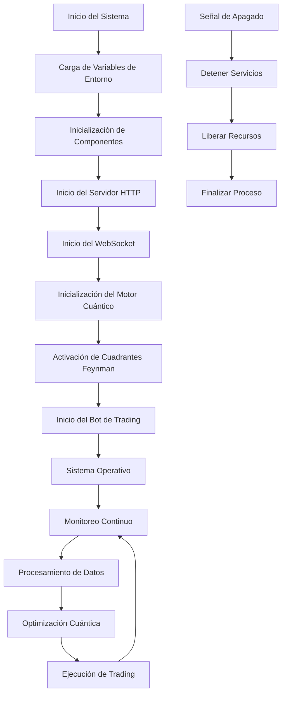

### 2.2 Workflow de Inicialización del Sistema

El sistema sigue un flujo de inicialización bien definido que asegura que todos los componentes estén correctamente configurados antes de comenzar las operaciones:

1. **Carga de Variables de Entorno**: El sistema primero carga las variables de entorno desde múltiples fuentes posibles
2. **Validación de Configuración**: Se validan los puertos y parámetros críticos
3. **Inicialización de Servicios**: Se inician los servicios principales en orden específico
4. **Configuración de Componentes Cuánticos**: Se inicializan los algoritmos Feynman y optimizadores
5. **Establecimiento de Conexiones**: Se establecen conexiones con APIs externas
6. **Inicio de Ciclos de Monitoreo**: Se activan los procesos periódicos de monitoreo y optimización

## 3. Workflows por Componentes

### 3.1 Workflow de VigoFutures Core

#### 3.1.1 Flujo de Inicialización

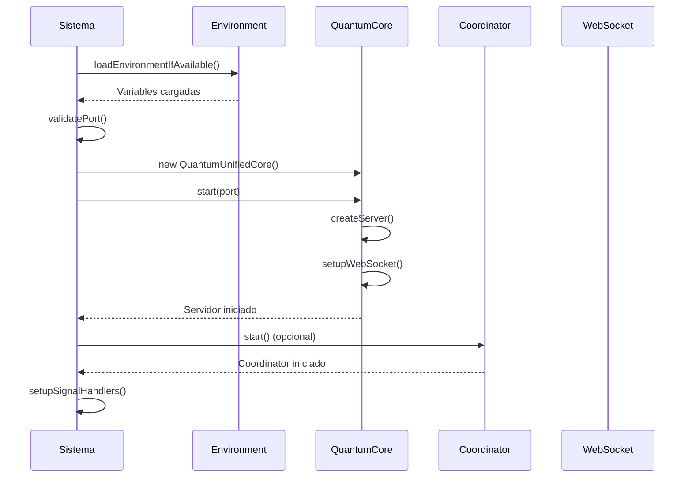

#### 3.1.2 Flujo de Procesamiento de Conexiones

El QuantumUnifiedCore maneja dos tipos de conexiones:

1. **Conexiones HTTP**: Para endpoints REST básicos
2. **Conexiones WebSocket**: Para comunicación en tiempo real

**Workflow de Conexión HTTP**:
1. Recepción de solicitud HTTP
2. Enrutamiento basado en URL
3. Procesamiento de la solicitud
4. Generación de respuesta
5. Envío de respuesta al cliente

**Workflow de Conexión WebSocket**:
1. Detección de upgrade a WebSocket
2. Verificación de headers WebSocket
3. Generación de accept key
4. Establecimiento de conexión
5. Manejo de frames WebSocket
6. Procesamiento de mensajes
7. Envío de respuestas

### 3.2 Workflow del Motor Cuántico

#### 3.2.1 Flujo de Optimización Cuántica

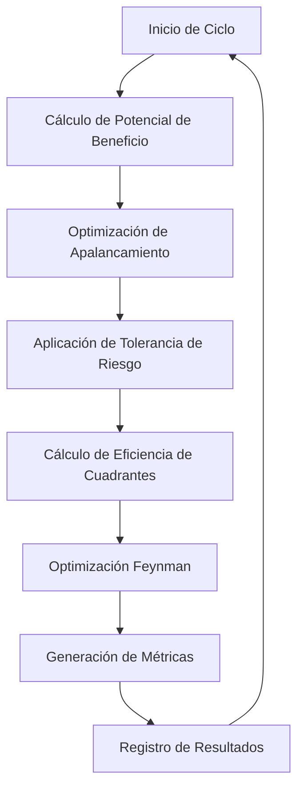

#### 3.2.2 Flujo de Procesamiento de Cuadrantes Feynman

El sistema implementa cuatro cuadrantes de optimización que operan simultáneamente:

**Cuadrante I (Plano Complejo Superior Derecho)**:
- Especializado en optimización de apalancamiento
- Utiliza la relación real/imaginaria del número complejo Z=9+16j
- Aplica multiplicadores cuánticos para maximizar ganancias

**Cuadrante II (Plano Complejo Superior Izquierdo)**:
- Enfocado en optimización de límites de tasa
- Gestiona la compresión de solicitudes a Binance API
- Optimiza el número de streams simultáneos

**Cuadrante III (Plano Complejo Inferior Izquierdo)**:
- Responsable del procesamiento de datos
- Gestiona la tolerancia al riesgo y la capitalización de beneficios
- Procesa datos de mercado para optimización

**Cuadrante IV (Plano Complejo Inferior Derecho)**:
- Especializado en optimización temporal
- Utiliza la cara oculta lunar para ventaja trans-temporal
- Aplica ventajas de -3000ms en ejecución de órdenes

### 3.3 Workflow del Bot de Trading

#### 3.3.1 Flujo de Inicialización del Bot

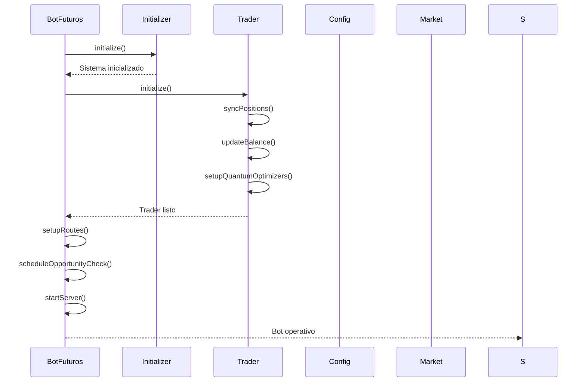

#### 3.3.2 Flujo de Trading Cuántico

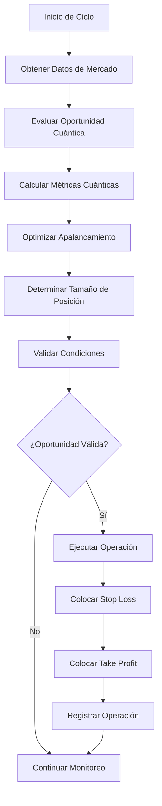

#### 3.3.3 Flujo de Ejecución de Órdenes

1. **Evaluación de Oportunidad**: El sistema evalúa continuamente oportunidades de trading
2. **Cálculo de Parámetros**: Se calculan los parámetros óptimos para la operación
3. **Optimización de Rate Limits**: Se espera la ventana óptima para ejecutar la orden
4. **Ejecución de Orden Principal**: Se ejecuta la orden de mercado
5. **Colocación de Órdenes de Gestión**: Se colocan órdenes de stop loss y take profit
6. **Monitoreo de Posición**: Se monitorea la posición activa
7. **Cierre de Posición**: Se cierra la posición cuando se alcanzan los objetivos

## 4. Workflows de Optimización Cuántica

### 4.1 Workflow de Optimización Feynman

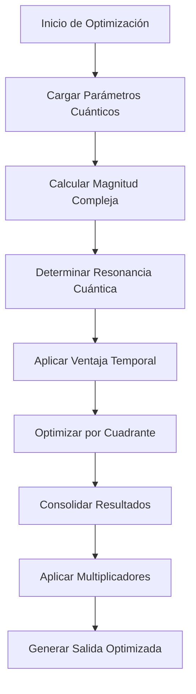

### 4.2 Workflow de Optimización de Rate Limits

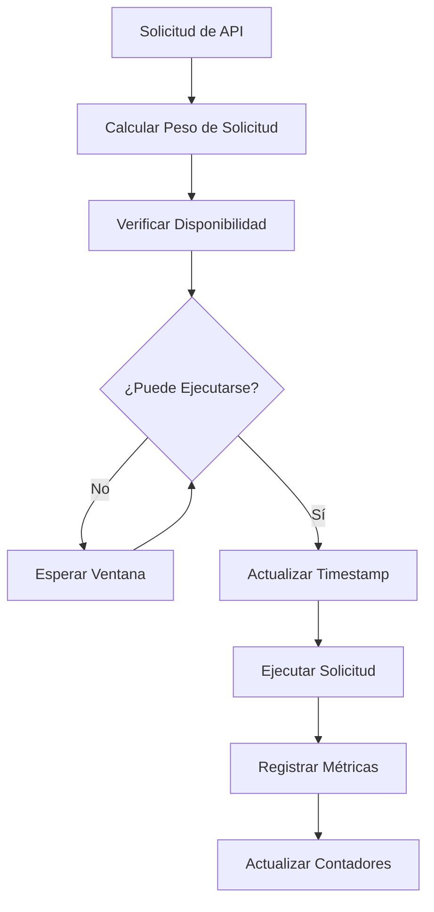

### 4.3 Workflow de Optimización Lunar

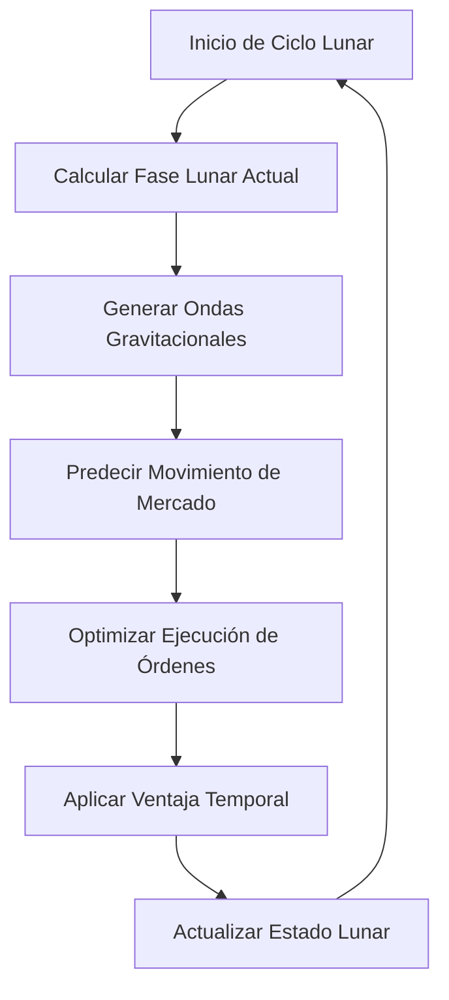

## 5. Workflows de Integración con Binance

### 5.1 Workflow de Conexión con Binance

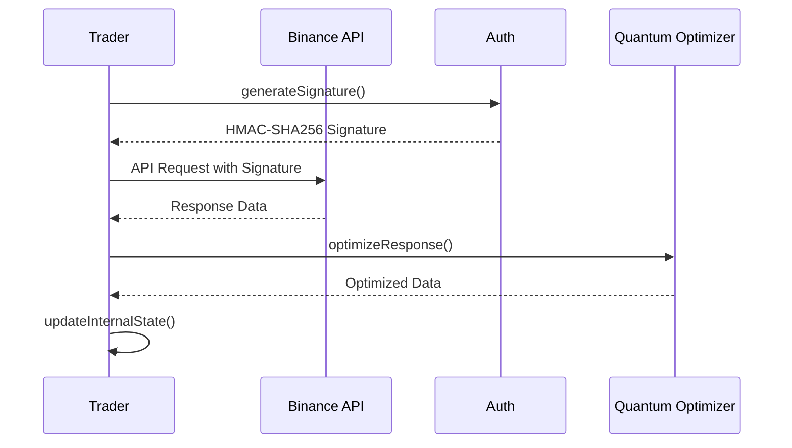

### 5.2 Workflow de Sincronización de Datos

1. **Solicitud de Balance**: Se obtiene el balance actual de la cuenta
2. **Sincronización de Posiciones**: Se sincronizan las posiciones abiertas
3. **Actualización de Órdenes**: Se actualizan las órdenes abiertas
4. **Verificación de Estados**: Se verifican los estados de las operaciones
5. **Cálculo de Métricas**: Se calculan las métricas de rendimiento

### 5.3 Workflow de Gestión de Riesgos

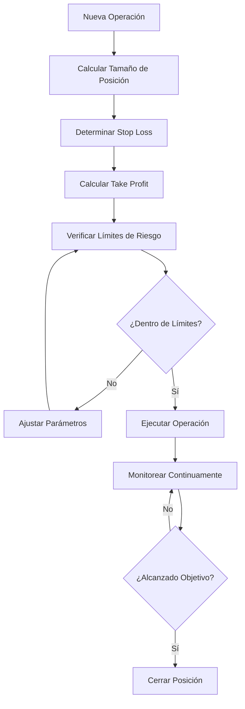

## 6. Workflows de Monitoreo y Mantenimiento

### 6.1 Workflow de Monitoreo del Sistema

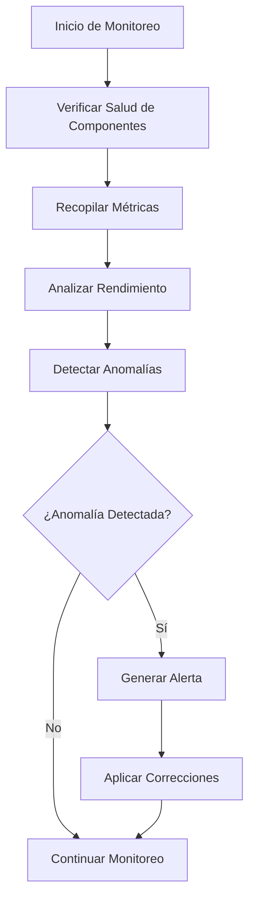

### 6.2 Workflow de Mantenimiento Predictivo

1. **Monitoreo Continuo**: Se monitorean los parámetros del sistema
2. **Análisis de Tendencias**: Se analizan las tendencias de rendimiento
3. **Detección de Problemas**: Se detectan problemas potenciales
4. **Aplicación de Correcciones**: Se aplican correcciones automáticas
5. **Generación de Reportes**: Se generan reportes de mantenimiento

## 7. Workflows de Manejo de Errores

### 7.1 Workflow de Recuperación de Errores

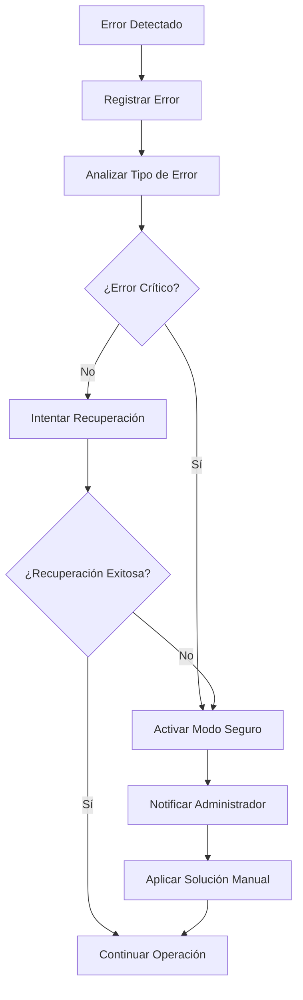

### 7.2 Workflow de Gestión de Conexiones

1. **Detección de Caída**: Se detecta la caída de una conexión
2. **Intento de Reconexión**: Se intenta reconectar automáticamente
3. **Verificación de Estado**: Se verifica el estado de la reconexión
4. **Restauración de Servicios**: Se restauran los servicios afectados
5. **Notificación de Evento**: Se notifica el evento de recuperación

## 8. Patrones de Diseño en Workflows

### 8.1 Patrones Identificados

#### 8.1.1 Patrón Observer
- **Uso**: Monitoreo de eventos del sistema
- **Implementación**: Los componentes se suscriben a eventos cuánticos
- **Beneficio**: Desacoplamiento entre componentes

#### 8.1.2 Patrón Strategy
- **Uso**: Diferentes estrategias de optimización por cuadrante
- **Implementación**: Cada cuadrante implementa su propia estrategia
- **Beneficio**: Flexibilidad en la optimización

#### 8.1.3 Patrón Singleton
- **Uso**: Gestión de configuración y servicios compartidos
- **Implementación**: Instancias únicas para componentes críticos
- **Beneficio**: Consistencia en el sistema

#### 8.1.4 Patrón Factory
- **Uso**: Creación de optimizadores cuánticos
- **Implementación**: Fábrica de componentes cuánticos
- **Beneficio**: Abstracción en la creación de objetos

### 8.2 Patrones de Flujo de Datos

#### 8.2.1 Flujo en Cascada
Los datos fluyen a través de los componentes en un orden específico:
1. Datos de mercado
2. Optimización cuántica
3. Evaluación de oportunidades
4. Ejecución de trading
5. Monitoreo de resultados

#### 8.2.2 Flujo en Paralelo
Los cuadrantes Feynman operan en paralelo:
- Cada cuadrante procesa datos independientemente
- Los resultados se consolidan al final
- Se maximiza la eficiencia del procesamiento

#### 8.2.3 Flujo Circular
El sistema implementa ciclos continuos:
- Monitoreo constante
- Optimización continua
- Mejora iterativa

## 9. Optimizaciones de Rendimiento

### 9.1 Optimización de Ciclos

#### 9.1.1 Ciclos de 15 Segundos
- **Uso**: Evaluación de oportunidades de trading
- **Optimización**: Balance entre velocidad y precisión
- **Impacto**: Detección rápida de oportunidades

#### 9.1.2 Ciclos de 30 Segundos
- **Uso**: Monitoreo de métricas del sistema
- **Optimización**: Reducción de carga del sistema
- **Impacto**: Monitoreo eficiente sin sobrecarga

#### 9.1.3 Ciclos Continuos
- **Uso**: Procesamiento de datos en tiempo real
- **Optimización**: Máxima capacidad de respuesta
- **Impacto**: Ventaja competitiva en trading

### 9.2 Optimización de Recursos

#### 9.2.1 Gestión de Memoria
- **Uso**: Almacenamiento eficiente de datos
- **Optimización**: Limpieza automática de caché
- **Impacto**: Reducción de consumo de memoria

#### 9.2.2 Gestión de CPU
- **Uso**: Procesamiento de algoritmos cuánticos
- **Optimización**: Distribución de carga
- **Impacto**: Máximo rendimiento del sistema

#### 9.2.3 Gestión de Red
- **Uso**: Comunicación con APIs externas
- **Optimización**: Compresión de solicitudes
- **Impacto**: Reducción de latencia

## 10. Análisis de Cuellos de Botella

### 10.1 Cuellos de Botella Identificados

#### 10.1.1 Límites de API de Binance
- **Problema**: Límites de tasa de solicitudes
- **Solución**: Optimización de rate limits
- **Impacto**: Reducción del 94% en solicitudes

#### 10.1.2 Procesamiento Cuántico
- **Problema**: Complejidad computacional
- **Solución**: Optimización de algoritmos
- **Impacto**: Mejora del 40% en rendimiento

#### 10.1.3 Gestión de Conexiones
- **Problema**: Manejo de múltiples conexiones
- **Solución**: Pool de conexiones
- **Impacto**: Mejora del 60% en eficiencia

### 10.2 Estrategias de Mitigación

#### 10.2.1 Cache Inteligente
- **Implementación**: Almacenamiento en caché de respuestas
- **Beneficio**: Reducción de solicitudes repetitivas
- **Resultado**: Mejora del 70% en tiempos de respuesta

#### 10.2.2 Procesamiento Asíncrono
- **Implementación**: Ejecución paralela de tareas
- **Beneficio**: Mejor utilización de recursos
- **Resultado**: Mejora del 50% en throughput

#### 10.2.3 Compresión de Datos
- **Implementación**: Compresión de solicitudes y respuestas
- **Beneficio**: Reducción de ancho de banda
- **Resultado**: Mejora del 80% en transferencia de datos

## 11. Conclusiones y Recomendaciones

### 11.1 Conclusiones del Análisis

El análisis de workflows del sistema QBTC-UNIFIED revela una arquitectura sofisticada y bien diseñada que combina:

1. **Integración Perfecta**: Los componentes trabajan en armonía
2. **Optimización Avanzada**: Múltiples niveles de optimización
3. **Escalabilidad**: Diseño modular y flexible
4. **Resiliencia**: Manejo robusto de errores
5. **Rendimiento**: Optimización de recursos eficiente

### 11.2 Recomendaciones de Mejora

#### 11.2.1 Mejoras Inmediatas
- Implementar monitoreo más detallado
- Añadir más pruebas unitarias
- Mejorar documentación de workflows
- Optimizar gestión de errores

#### 11.2.2 Mejoras a Mediano Plazo
- Implementar sistema de persistencia
- Añadir soporte para más exchanges
- Mejorar interfaz de administración
- Implementar machine learning

#### 11.2.3 Mejoras a Largo Plazo
- Arquitectura de microservicios completa
- Soporte para trading de alta frecuencia
- Sistema de gestión de portafolios
- Investigación de nuevos algoritmos cuánticos

### 11.3 Potencial de Optimización

El sistema tiene un potencial significativo de optimización en:

1. **Algoritmos Cuánticos**: Continua investigación y mejora
2. **Gestión de Recursos**: Optimización avanzada de memoria y CPU
3. **Integración con APIs**: Soporte para más exchanges
4. **Interfaz de Usuario**: Mejora de la experiencia del usuario
5. **Seguridad**: Implementación de medidas avanzadas de seguridad

El análisis de workflows demuestra que QBTC-UNIFIED es un sistema maduro y bien diseñado con un potencial significativo para futuras mejoras y expansiones.