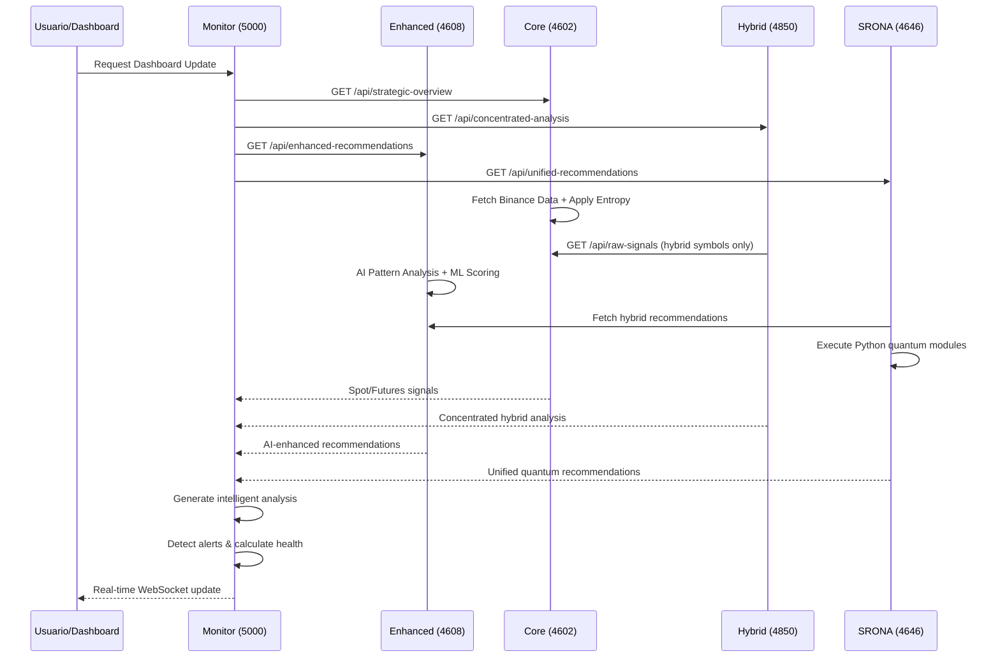

# 🔬 ANÁLISIS DETALLADO DEL WORKFLOW DE RECOMENDACIONES
## Ecosistema de Trading Inteligente - Arquitectura Completa

---

## 📊 ARQUITECTURA GENERAL DEL SISTEMA

El ecosistema consta de **6 sistemas principales** interconectados que generan recomendaciones de trading mediante un proceso distribuido y coordinado:

```
┌─────────────────────────────────────────────────────────────────┐
│                    ECOSISTEMA DE TRADING INTELIGENTE           │
├─────────────────────────────────────────────────────────────────┤
│  Core Anti-418 (4602) → Enhanced Recommendations (4608)        │
│          ↓                           ↑                         │
│  Concentrated Hybrid (4850) ←→ SRONA Quantum Bridge (4646)     │
│          ↓                           ↑                         │
│  Intelligence Monitor (5000) ←→ Enhanced Dashboard (5001)      │
└─────────────────────────────────────────────────────────────────┘
```

---

## 🚀 WORKFLOW DETALLADO DE GENERACIÓN DE RECOMENDACIONES

### FASE 1: 📡 ADQUISICIÓN DE DATOS PRIMARIOS

#### 1.1 Core Anti-418 System (Puerto 4602)
**Función Principal**: Motor primario de señales y oportunidades

**Proceso de Generación**:
```javascript
async analyzeMarket() {
    // 1. Obtener datos de Binance (SPOT + FUTURES)
    const spotData = await this.fetchSpotSignals();
    const futuresData = await this.fetchFuturesOpportunities();
    
    // 2. Aplicar entropía del sistema (NO Math.random)
    const entropy = this.entropyEngine.getEntropy();
    
    // 3. Generar señales con circuit breakers
    if (this.circuitBreaker.canExecute('spot')) {
        // Análisis técnico con indicadores
        // RSI, MACD, Bollinger Bands, etc.
    }
    
    // 4. Rate limiting humano (5-15 segundos entre requests)
    await this.rateLimiter.applyHumanDelay();
}
```

**Salida**:
- `GET /api/raw-signals` → Señales SPOT procesadas
- `GET /api/raw-opportunities` → Oportunidades FUTURES
- `GET /api/strategic-overview` → Resumen estratégico

#### 1.2 Concentrated Hybrid System (Puerto 4850) 
**Función Principal**: Análisis concentrado en intersección SPOT+FUTURES

**Proceso Único**:
```javascript
const TOP_HYBRID_SYMBOLS = [
    'BTCUSDT', 'ETHUSDT', 'BNBUSDT', // TIER 1: LA TRINIDAD
    'SOLUSDT', 'XRPUSDT', 'DOGEUSDT', // TIER 2: CORTE NOBLE
    // ... 58 símbolos más curados por tiers
];

async analyzeConcentratedMarket() {
    // 1. Filtrar solo símbolos híbridos curados
    const hybridData = await this.fetchHybridData();
    
    // 2. Calcular correlaciones concentradas
    const correlations = this.analyzeConcentratedCorrelations(hybridData);
    
    // 3. Clasificar por calidad:
    //    - PERFECT: >85% correlación
    //    - GOOD: 70-85% correlación  
    //    - MEDIUM: 55-70% correlación
    
    // 4. Generar recomendaciones premium híbridas
    const recommendations = this.generateConcentratedRecommendations();
}
```

**Salida**:
- `GET /api/concentrated-analysis` → Análisis híbrido concentrado
- `GET /api/tier-analysis` → Análisis por tiers de calidad

---

### FASE 2: 🤖 PROCESAMIENTO DE IA AVANZADO

#### 2.1 Enhanced Recommendations Service (Puerto 4608)
**Función Principal**: Motor de IA sin dependencias externas

**Arquitectura de IA**:
```javascript
class AIRecommendationEngine {
    constructor() {
        // CLAVE: NO usa Math.random - Solo entropía del sistema
        this.entropyGenerator = new SystemEntropyGenerator();
        this.patternDatabase = new Map();
        this.performanceHistory = [];
    }
    
    generateSystemBasedRandom() {
        // Usar métricas reales del sistema
        const cpuUsage = process.cpuUsage();
        const memory = process.memoryUsage();
        const hrTime = process.hrtime.bigint();
        
        // Crear entropía del hash SHA-256
        const entropy = crypto.createHash('sha256')
            .update(Buffer.from([...hrTime, ...cpu, ...memory]))
            .digest();
            
        return entropy.readUInt32BE(0) / 0xFFFFFFFF;
    }
}
```

**Proceso de Análisis Inteligente**:
1. **Análisis de Patrones ML**: Detecta tendencias de memoria, CPU y correlaciones
2. **Scoring Dinámico**: 
   ```javascript
   SCORING_WEIGHTS = {
       HISTORICAL_ACCURACY: 0.30,
       MARKET_CORRELATION: 0.25,
       AI_CONFIDENCE: 0.20,
       DATA_FRESHNESS: 0.15,
       PATTERN_STRENGTH: 0.10
   }
   ```
3. **Cache Inteligente**: TTL 5 minutos con limpieza automática
4. **Alertas Propias**: Monitoreo de memoria, CPU y cache

**Salida**:
- `GET /api/enhanced-recommendations` → Recomendaciones IA procesadas
- `GET /api/pattern-analysis` → Análisis de patrones ML
- `GET /api/performance-metrics` → Métricas de rendimiento
- `GET /api/alerts` → Alertas del servicio

#### 2.2 SRONA Quantum Bridge (Puerto 4646)
**Función Principal**: Integración Python ↔ Node.js para análisis cuántico

**Workflow de Integración**:
```javascript
async unifyRecommendations() {
    // 1. Obtener recomendaciones híbridas del ecosistema
    await this.fetchHybridRecommendations();
    
    // 2. Ejecutar módulos Python cuánticos
    const quantumModules = [
        'ionic_dance',      // Análisis iónico
        'fractal_time',     // Tiempo fractal
        'z_plane',          // Utilidad Z-plane
        'prime_transposition', // Transposición prima
        'gravitational',    // Modelo gravitacional
        'integrated'        // Sistema integrado
    ];
    
    // 3. Procesar cada módulo Python
    for (const module of quantumModules) {
        const result = await this.executeQuantumModule(module);
        this.quantumRecommendations.push(result);
    }
    
    // 4. Unificar recomendaciones cuánticas + híbridas
    const unified = this.calculateUnifiedRecommendations();
    return unified;
}
```

**Salida**:
- `GET /api/unified-recommendations` → Recomendaciones unificadas cuántico+híbrido
- `GET /api/bridge-status` → Estado del bridge
- `GET /api/full-quantum-analysis` → Suite completa cuántica

---

### FASE 3: 📊 MONITOREO Y VISUALIZACIÓN

#### 3.1 Intelligent Monitor Dashboard (Puerto 5000)
**Función Principal**: Monitoreo en tiempo real del ecosistema

**Motor de Monitoreo**:
```javascript
class IntelligentMonitor {
    async updateAllSystems() {
        // 1. Monitoreo paralelo de todos los servicios
        const systemUpdates = [];
        for (const [key, system] of Object.entries(MONITOR_CONFIG.SYSTEMS)) {
            systemUpdates.push(this.updateSystemStatus(key, system));
        }
        
        // 2. Análisis inteligente consolidado
        const analysis = this.generateIntelligentAnalysis();
        
        // 3. Detección de alertas
        this.detectAlerts();
        
        // 4. WebSocket en tiempo real
        if (this.connectedClients > 0) {
            io.emit('systemUpdate', {
                systems: this.systemsStatus,
                analysis: analysis,
                alerts: this.alerts,
                performance: this.getPerformanceMetrics()
            });
        }
    }
}
```

**Métricas Monitoreadas**:
- Response time de cada servicio
- Error rates y circuit breakers
- Calidad de datos (data quality)
- Correlaciones encontradas
- Health del ecosistema completo

#### 3.2 Enhanced Dashboard (Puerto 5001)
**Función Principal**: Dashboard avanzado con análisis técnico

**Características Especiales**:
- Integración con Enhanced Recommendations Service
- Integración con SRONA Quantum Bridge  
- Análisis de patrones IA
- Métricas de performance en tiempo real
- Alertas avanzadas por nivel de consciencia

---

## 🔄 FLUJO COMPLETO DE DATOS

### Secuencia Temporal Típica:



---

## 🎯 ALGORITMOS CLAVE DE GENERACIÓN

### 1. Scoring Híbrido (Concentrated System):
```javascript
const hybridScore = (
    hybridConfidence * 0.35 +           // Confianza combinada SPOT+FUTURES
    (spotStrength / 10) * 0.15 +        // Fuerza de señal SPOT
    (Math.min(leverage / 15, 1)) * 0.25 + // Factor leverage normalizado
    entropyFactor * 0.15 +              // Factor entropía del sistema
    (qualityMultiplier - 1) * 0.10      // Bonus por calidad de correlación
);
```

### 2. Clasificación por Tiers:
- **TIER 1**: La Trinidad Suprema (BTC, ETH, BNB) - Multiplicador 0.8x (conservador)
- **TIER 2**: Corte Noble - Multiplicador 0.9x
- **TIER 3**: Nobleza Popular - Multiplicador 1.0x  
- **TIER 4**: Emergentes - Multiplicador 1.1x
- **TIER 5**: Memes - Multiplicador 1.2x
- **TIER 6**: Especialistas - Multiplicador 1.3x

### 3. Entropía del Sistema (Reemplazo de Math.random):
```javascript
generateSystemBasedRandom() {
    const cpuUsage = process.cpuUsage(this.processMetrics);
    const memory = process.memoryUsage();
    const hrTime = process.hrtime.bigint();
    
    const entropy = Buffer.from([
        ...Buffer.from(hrTime.toString(16), 'hex'),
        ...Buffer.from((cpuUsage.user % 256).toString()),
        ...Buffer.from((memory.heapUsed % 256).toString()),
        ...Buffer.from((this.requestCounter % 256).toString())
    ]);
    
    const hash = crypto.createHash('sha256').update(entropy).digest();
    return hash.readUInt32BE(0) / 0xFFFFFFFF;
}
```

---

## 🛡️ SISTEMAS DE PROTECCIÓN

### Circuit Breakers Avanzados:
```javascript
const breakers = {
    spot: {
        threshold: 3,           // 3 fallas para abrir
        timeout: 120000,        // 2 minutos inicial
        maxTimeout: 600000,     // 10 minutos máximo
    },
    futures: {
        threshold: 3,
        timeout: 120000, 
        maxTimeout: 600000,
    }
};

// Escalamiento de timeouts:
if (statusCode === 418) {
    breaker.timeout *= 3;      // Error 418 - máximo castigo
} else if (statusCode === 429) {
    breaker.timeout *= 2;      // Rate limit - castigo medio
}
```

### Rate Limiting Humano:
```javascript
const config = {
    minDelay: 5000,            // 5 segundos mínimo
    maxDelay: 15000,           // 15 segundos máximo
    maxRequestsPerMinute: 10,  // Ultra-conservador
    breakProbability: 0.15,    // 15% prob. de descanso
    breakDuration: { min: 30000, max: 120000 } // 30s-2min descanso
};
```

---

## 📈 OPTIMIZACIONES DE PERFORMANCE

### Intervalos Optimizados (Reducción de Overhead):
- **Core Anti-418**: Rate limiting humano 5-15s
- **Enhanced Recommendations**: Cache inteligente 5min TTL  
- **Intelligent Monitor**: 15s updates (reducido de 5s = 3x menos overhead)
- **Enhanced Dashboard**: 20s updates (reducido de 10s = 2x menos overhead)

### Logging Inteligente:
- Solo logs si processing time > 1000ms
- Solo logs de recomendaciones con cambios significativos (±5)
- Logs rotativos para prevenir memory leaks

### Memory Management:
```javascript
// En Enhanced Recommendations:
if (this.patternDatabase.size > 500) {
    // Limpiar patrones antiguos automáticamente
    const sortedPatterns = Array.from(this.patternDatabase.entries())
        .sort((a, b) => b[1].timestamp - a[1].timestamp);
    this.patternDatabase.clear();
    sortedPatterns.slice(0, 250).forEach(([key, value]) => {
        this.patternDatabase.set(key, value);
    });
}

// Forzar garbage collection cada 100 patrones
if (global.gc && this.patternDatabase.size % 100 === 0) {
    global.gc();
}
```

---

## 🔍 PUNTOS CLAVE DEL WORKFLOW

### ✅ Fortalezas del Sistema:

1. **Arquitectura Distribuida**: Cada servicio tiene responsabilidad específica
2. **Redundancia**: Múltiples fuentes de recomendaciones (Core, Hybrid, IA, Quantum)
3. **Entropía Real**: No dependencia de Math.random - usa métricas del sistema
4. **Circuit Breakers**: Protección automática contra errores 418 de Binance
5. **Rate Limiting Humano**: Simula comportamiento humano para evitar detección
6. **Monitoreo Inteligente**: WebSockets en tiempo real con dashboards interactivos
7. **IA Sin Dependencias**: Motor ML propio sin librerías externas
8. **Integración Cuántica**: Bridge para análisis Python avanzados

### 🎯 Flujo de Decisión Típico:

1. **Usuario consulta dashboard** → Monitor solicita updates
2. **Core Anti-418 consulta Binance** → Aplica entropía + circuit breakers
3. **Concentrated Hybrid filtra 58 símbolos top** → Correlaciones SPOT+FUTURES
4. **Enhanced IA procesa patrones** → ML scoring sin dependencias
5. **SRONA ejecuta módulos Python** → Análisis cuántico integrado
6. **Monitor consolida todo** → Análisis inteligente + alertas
7. **Dashboard actualiza en tiempo real** → WebSocket push a cliente

### 🔧 Personalización Avanzada:

- **Symbols targeting**: 58 símbolos híbridos curados por tiers
- **Scoring weights configurable**: Histórico 30%, Correlación 25%, IA 20%, etc.
- **Thresholds ajustables**: Correlaciones, alertas, circuit breakers
- **Timeouts escalables**: Desde 2min hasta 10min según error type
- **Cache TTL flexible**: 5min default con cleanup automático

---

## 🚀 CONCLUSIÓN

Este workflow representa un **ecosistema de trading de alta sofisticación** que combina:

- **Análisis técnico tradicional** (Core Anti-418)
- **Correlaciones híbridas avanzadas** (Concentrated Hybrid)  
- **Inteligencia artificial propia** (Enhanced Recommendations)
- **Análisis cuántico integrado** (SRONA Bridge)
- **Monitoreo inteligente en tiempo real** (Dashboards)

La arquitectura está diseñada para ser **robusta, escalable y libre de dependencias críticas**, usando entropía del sistema para aleatoriedad, circuit breakers para protección, y rate limiting humano para evitar detección algorítmica.

**El resultado final son recomendaciones de trading multi-dimensionales** que combinan señales técnicas, correlaciones híbridas, patrones de IA y análisis cuántico, todo monitoreado y visualizado en tiempo real.
